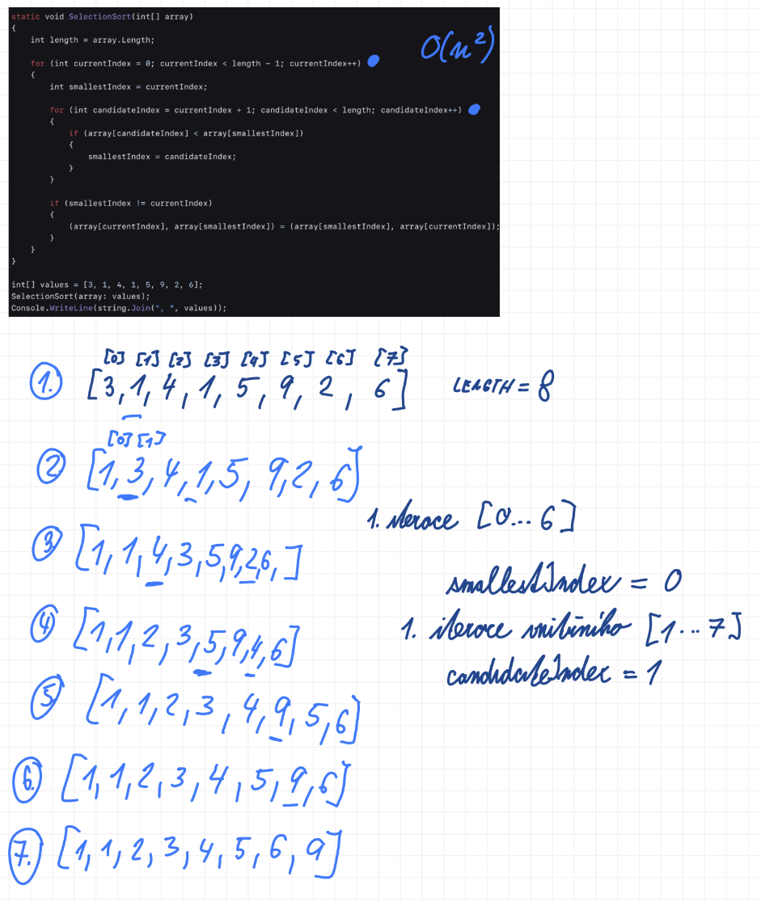

## 2

Komplexní algoritmy nad seznamy (filtrování, vyhledávání, třídění/řazení výběrem nebo vkládáním), efektivnější implementace vyhledávání a třídění (binární vyhledávání, merge sort), časová složitost algoritmů

### Užitečné odkazy
- <https://visualgo.net/en/sorting> (vizualizace)
- <https://youtu.be/RfXt_qHDEPw> (řadící algoritmy)
- <https://youtu.be/LOcfJorH7xs> (Insertion Sort - česky)
- <https://youtu.be/g-PGLbMth_g> (Selection Sort - anglicky)
- <https://runestone.academy/ns/books/published/pythonds/SortSearch/TheMergeSort.html> (Merge Sort)

### Filtrování
- proces extrakce prvků ze vstupní množiny na základě specifikovaného predikátu, přičemž výsledkem je podmnožina, jejíž kardinalita je menší nebo rovna kardinalitě množiny původní

$$S' = \{x \in S \mid P(x)\}$$

$$|S'| \leq |S|$$

- $S'$ = výsledná podmnožina
- $S$ = vstupní množina
- $x$ = libovolný prvek náležející do množiny $S$
- $P(x)$ = predikát

#### Příklad

Mějme množinu čísel $S = \{1, 5, 8, 12, 15\}$ a predikát $P(x)$, který říká, že „$x$ je sudé číslo“.

$$P(x) \equiv x \pmod 2 = 0$$

- $1$ → $P(1)$ je nepravda
- $8$ → $P(8)$ je pravda
- ...

$$S' = \{x \in S \mid P(x)\} = \{8, 12\}$$
$$S' = \{x \in S \mid x \pmod 2 = 0\} = \{8, 12\}$$

Výsledkem bude $S' = \{8, 12\}$, přičemž platí, že počet prvků (kardinalita) výsledku je menší než počet prvků vstupu ($2 \leq 5$).

#### Pojmy
- Kardinalita = počet prvků dané množiny.
- Predikát = podmínka/funkce nabývající hodnot pravda nebo nepravda (P(x) - pro daný prvek $x$).

### Vyhledávání
- proces identifikace a lokalizace konkrétního prvku ve vstupní množině na základě zadaného identifikátoru nebo predikátu

#### Příklad

Mějme uspořádanou množinu $S = \{1, 5, 8, 12, 15\}$ a hledejme prvek $x_{target} = 12$.

Definujeme predikát shody: $P(x) \colon x = 12$.

Algoritmus projde množinu $S$ a testuje $P(x)$ pro každý prvek.

Pro $x = 12$ je $P(12)$ pravda.

Výsledek: Prvek nalezen na pozici (indexu) $i = 3$ (při indexování od 0).$$S[i] = x_{target}$$

#### Pojmy
- Identifikátor = unikátní hodnota, která slouží k jednoznačnému odlišení konkrétního prvku od ostatních v rámci dané množiny (např. ID).
- Identifikace = proces vyhodnocení predikátu.
- Lokalizace = proces určení přesného umístění identifikovaného prvku.

### Rozdíl mezi filtrováním a vyhledáváním
Zatímco filtrování vytváří novou podmnožinu prvků na základě platnosti predikátu, vyhledávání provádí identifikaci a následnou lokalizaci konkrétního prvku za účelem získání jeho indexu nebo potvrzení existence.

### Třídění / Řazení
- proces transformace prvků vstupní množiny do takové permutace, která odpovídá zvolené relaci uspořádání, přičemž kardinalita množiny zůstává invariantní

Mějme vstupní množinu $S$. Třídění je proces hledání takové permutace $S_{sorted}$, pro kterou platí:

$$x_1 \leq x_2 \leq \dots \leq x_n$$
$$|S_{sorted}| = |S|$$

- $S$ = vstupní množina
- $S_{sorted}$ = výsledná seřazená množina
- $\leq$ = relace uspořádání
- $\lvert S \rvert$ = kardinalita

#### Příklad

Mějme množinu $S = \{15, 5, 12, 1, 8\}$ a relaci uspořádání $\leq$ (vzestupně).

1. **Vstup:** Permutace $\{15, 5, 12, 1, 8\}$.
2. **Proces:** Transformace prvků na základě porovnávání dvojic.
3. **Výstup:** Permutace $S_{sorted} = \{1, 5, 8, 12, 15\}$.

**Výsledkem je seřazená posloupnost:**
$$1 \leq 5 \leq 8 \leq 12 \leq 15$$
$$|S_{sorted}| = 5$$

#### Pojmy
- Transformace = proces změny stavu nebo struktury dat (v tomto případě změna pořadí prvků z původního na seřazené).
- Permutace = jedno z možných uspořádání prvků dané množiny (přerovnání prvků tak, že žádný nechybí ani nepřebývá)
- Relace uspořádání = pravidlo, které určuje vzájemnou pozici dvou prvků (např. zda je prvek menší, větší, nebo roven jinému).
- Invariantní = vlastnost, která se v průběhu procesu nemění (u třídění je invariantem počet prvků – kardinalita)

### Třídění výběrem (Selection Sort)
- časová složitost: $O(n^2)$
- prostorová složitost: $O(1)$

Principiálně algoritmus funguje tak, že řekneme, že momentální index je ten nejmenší. Pak se začneme koukat na jeho sousedy napravo a jakmile narazíme na souseda, který je menší, řekneme, že on je ve skutečnosti ten nejmenší index a měli by si vyměnit místo. Není to ale tak, že by narazil na prvního menšího souseda a tím to končilo - on projde všechny sousedy a vybere opravdu toho nejmenšího z nich. Až pak se teprve prohodí s tím opravdu nejmenším. Indexy se pak o jedna posunou a ten stejný proces se jede odznova.

1. Na začátku je na currentIndex trojka a na candidateIndex je jednička. V cyklu je ta podmínka jestli je jednička menší než trojka, což je pravda, takže jednička je smallestIndex. Pak se koukáme na čtyřku, a ptáme se - je čtyřka menší než jednička? Není, takže se ptáme je jednička menší než jednička? Není, takže se ptáme je pětka menší než jednička? Není, takže se ptáme je devítka menší než jednička? Není, takže se ptáme je dvojka menší než jednička? Není, takže se ptáme je šestka menší než jednička? Není, vnitřní cyklus končí, z první iterace vyplynulo, že smallestIndex je ta jednička, a protože smallestIndex není currentIndex (jednička není trojka), tak je prohodíme. Jednička se dostala na nulté místo, trojka se přesunula na první místo.

2. Teď se zvedne currentIndex o jedna, takže původně byl nula, teď je jedna. To samé candidateIndex - původně byl jedna, teď bude dva. Vždycky o jedno větší než currentIndex. Takže teď je na currentIndex trojka a na candidateIndex je čtyřka. A teď stejný proces jako předtím. Je čtyřka menší než trojka? Není, takže se ptáme je jednička menší než trojka? Ano, je, řekneme že smallestIndex je index jedničky. Jdeme dál - je pětka menší než jednička? Není, takže se ptáme je devítka menší než jednička? Není, takže se ptáme je dvojka menší než jednička? Není, takže se ptáme je šestka menší než jednička? Není, vnitřní cyklus končí, z druhé iterace vyplynulo, že smallestIndex je znovu jednička, ale ta další co se nachází v seznamu, takže ji prohodíme s trojkou.

A takhle znovu a znovu.

### Třídění vkládáním (Insertion Sort)
- časová složitost: $O(n^2)$ (nejhorší), $O(n)$ (nejlepší - již seřazené pole)
- prostorová složitost: $O(1)$

#### Princip
- pole se postupně buduje jako seřazené zleva doprava
- v každém kroku se vezme prvek na currentIndex
- tento prvek (currentValue) se porovnává s prvky vlevo
- větší prvky se posouvají o jednu pozici doprava
- hledá se správné místo pro vložení
- prvek se vloží na správnou pozici (sortedIndex + 1)
- levá část pole je po každém kroku seřazená

### Binární vyhledávání (Binary Search)
- časová složitost: $O(\log n)$
- prostorová složitost: $O(1)$
- prerekvizita: pole musí být seřazené

#### Princip
- udržují se dva indexy: leftIndex a rightIndex, které ohraničují aktuální interval
- v každém kroku se spočítá middleIndex
- porovná se hodnota uprostřed s hledaným prvkem (target):
   - pokud se rovnají -> nalezeno
   - pokud je prostřední hodnota větší -> hledá se vlevo (zmenší se rightIndex)
   - pokud je menší -> hledá se vpravo (zvětší se leftIndex)
- interval se tak v každém kroku zmenší na polovinu
- končí, když je prvek nalezen nebo interval zanikne (leftIndex > rightIndex)

### Merge Sort
- časová složitost: $O(n \log n)$
- prostorová složitost: O(n)
- založen na principu rozděl a panuj (divide and conquer)

#### Princip
- pole se rekurzivně dělí na poloviny, dokud nevzniknou podpole o velikosti 1
tato podpole jsou triviálně seřazená
- následuje fáze slučování (merge)
- dvě seřazená pole (left, right) se procházejí současně
- vždy se vezme menší prvek z obou a vloží se do výsledného pole (target)
- po vyčerpání jednoho pole se zbytek druhého pouze zkopíruje
- slučováním vznikají postupně větší seřazené celky, až vznikne celé seřazené pole