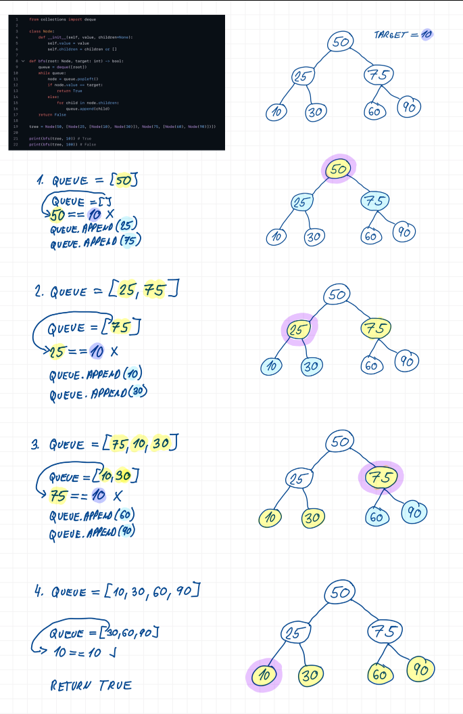

## 3

Spojové datové struktury (jednosměrný spojový seznam, binární strom) a základní operace nad nimi (vkládání, výmaz, vyhledávání) včetně časové složitosti

### Užitečné odkazy
- <https://szz.ondrejsvorc.cz/01%20-%20SZZTP%20-%20Teoretick%C3%A9%20z%C3%A1klady%20informatiky/03/>
- <https://ki.ujep.cz/opory/Aplikovana_Informatika/NMgr/Pokrocile_datove_struktury_a_algoritmy.html#Spojov%C3%BD-seznam>
- <https://cw.fel.cvut.cz/b182/_media/courses/b6b36dsa/dsa-3-slozitostalgoritmu.pdf>
- <https://www.youtube.com/watch?v=p85ohoV6Z4E> (Binární strom - anglicky)
- <https://youtu.be/76dhtgZt38A?si=ZHMRrxems4Jc4nt5> (Binární strom - anglicky, přednáška z MIT)

### Spojový seznam
- lineární datová struktura tvořená uzly
- jednosměrný / obousměrný

### Jednosměrný spojový seznam
- spojový seznam, ve kterém každý uzel obsahuje právě jeden odkaz, a to na následující uzel, čímž vzniká jednosměrný řetězec prvků od počátečního uzlu (head) k poslednímu uzlu, který neodkazuje na žádný další uzel (tj. má odkaz na null)

#### Základní operace
- vkládání
    - vložení prvku na začátek seznamu $O(1)$
    - vložení prvku na konec seznamu $O(n)$
- výmaz
    - nalezení prvku a přepojení odkazů $O(n)$
- vyhledávání
    - sekvenční průchod od počátečního uzlu až do nalezení $O(n)$

#### Uzel
- základní prvek spojového seznamu, který obsahuje data a referenci na další uzel
- vztah `Node -> Node` představuje rekurzivní asociaci
- v rámci spojového seznamu lze uzly zároveň chápat jako kompozici seznamu

```csharp
public sealed class Node(int data, Node? next = null)
{
    public int Data { get; set; } = data;

    public Node? Next { get; set; } = next;
}
```

### Strom
- rekurzivní hierarchická datová struktura složená z uzlů, které jsou propojené hranami (odkazy)
- obsahuje právě jeden počáteční uzel nazývaný kořen (`root`)
- z kořene se struktura větví do dalších uzlů
- každý uzel kromě kořene má právě jednoho rodiče (`parent`)
- z každého uzlu může vést libovolný počet potomků (`children`)
- každý uzel může být současně:
  - rodičem jiných uzlů
  - potomkem jiného uzlu

### Uzel
- základní prvek stromu
- reprezentuje jeden bod ve stromové struktuře
- obsahuje:
  - hodnotu (`value`)
  - odkazy na další uzly (potomky)
- v binárním stromu konkrétně:
  - odkaz na levý podstrom
  - odkaz na pravý podstrom

### Kořen
- nejvyšší uzel stromu
- vstupní bod celé struktury
- jako jediný nemá rodiče
- všechny ostatní uzly jsou z něj dosažitelné

### Rodič
- uzel přímo nad jiným uzlem
- uzel, ze kterého vede odkaz na potomka

### Potomek
- uzel přímo pod jiným uzlem
- v binárním stromu rozlišujeme:
  - levého potomka
  - pravého potomka

### Sourozenec
- uzel se stejným rodičem jako jiný uzel
 
### Předek
- libovolný uzel na cestě od daného uzlu ke kořeni stromu

### Vnitřní uzel
- anglicky internal node
- uzel, který má alespoň jednoho potomka (není listem)
- slouží jako spojovací bod mezi dalšími částmi stromu
- v binárním stromu má maximálně dva potomky

### List
- uzel bez potomků
- nemá levého ani pravého potomka
- koncový bod stromu

### Podstrom
- část stromu tvořená jedním uzlem a všemi jeho potomky
- každý uzel je současně kořenem svého podstromu
- i samotný list je validní podstrom
- podstrom je opět strom (rekurzivní povaha stromových struktur)

### Hloubka uzlu
- počet hran od kořene k danému uzlu

### Úroveň uzlu
- hloubka uzlu + 1
- všechny uzly se stejnou hloubkou jsou na stejné úrovni
- př.: máme kořen 50, tak jeho hloubka je 0 a úroveň 1
  - počet hran od kořene ke kořeni je totiž 0
  - a úroveň uzlu je závislá na hloubce uzlu, takže 0 + 1 = 1

### Výška stromu
- délka nejdelší cesty od kořene k listu
- udává, kolik úrovní strom obsahuje
- měří se počtem hran nebo počtem uzlů
- nejčastější definice je ta, že výška je počet hran na nejdelší cestě

### Vyvážený strom
- strom, v němž se výšky levého a pravého podstromu u každého uzlu liší maximálně o 1

### Nevyvážený strom
- strom, v němž se výšky levého a pravého podstromu alespoň u jednoho uzlu liší o více než 1

### Průchod stromem
- proces, při kterém navštívíme každý uzel ve stromu právě jednou
- základní typy průchodů:
  - DFS (Depth First Search)
  - BFS (Breadth First Search)

### DFS
- průchod stromem do hloubky
- nejprve prochází co nejhlouběji jednou větví, poté se vrací zpět
- typicky využívá rekurzi nebo zásobník
- varianty:
  - preorder
  - inorder
  - postorder

### BFS
- průchod stromem do šířky
- prochází strom po jednotlivých úrovních
- nejprve navštíví všechny uzly na aktuální úrovni, poté pokračuje níže
- typicky využívá frontu



### Binární strom
- speciální případ stromu, v němž každý uzel může mít maximálně dva potomky:
  - levého potomka (`left child`)
  - pravého potomka (`right child`)
- pořadí potomků je důležité - levý a pravý potomek nejsou zaměnitelní
- každý potomek je současně kořenem svého podstromu
- každý podstrom je opět binární strom

### Binární vyhledávací strom
- anglicky Binary Search Tree (BST)
- speciální typ binárního stromu
- pro každý uzel platí:
  - všechny hodnoty v levém podstromu jsou menší než hodnota uzlu
  - všechny hodnoty v pravém podstromu jsou větší než hodnota uzlu
- toto pravidlo platí rekurzivně pro celý strom