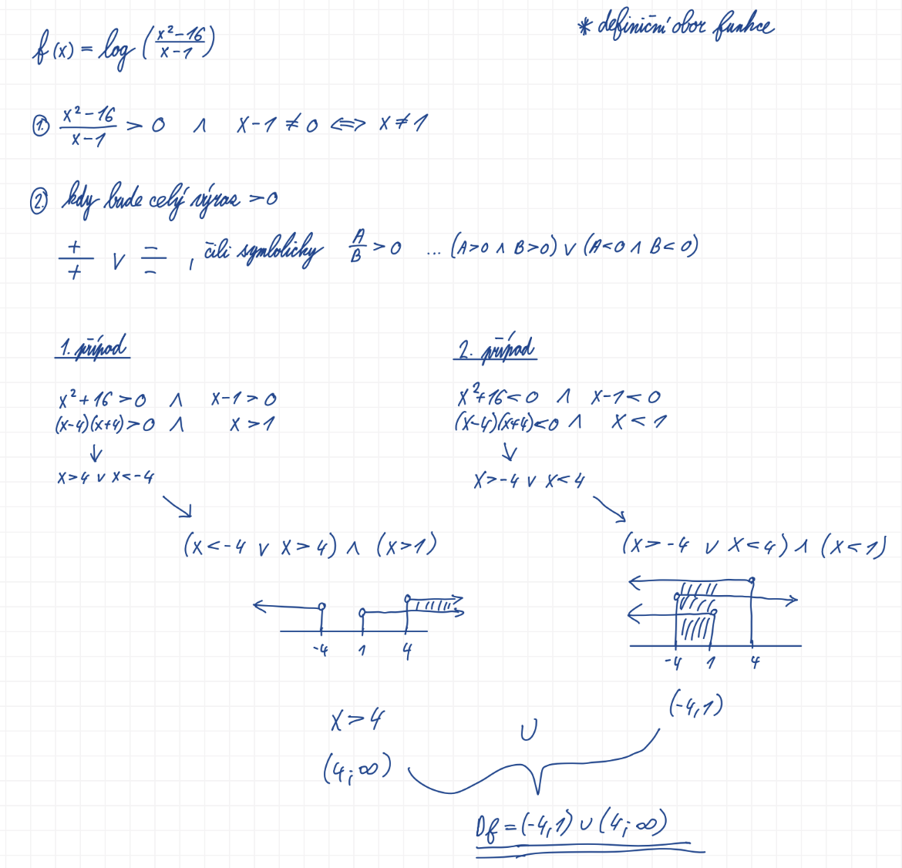
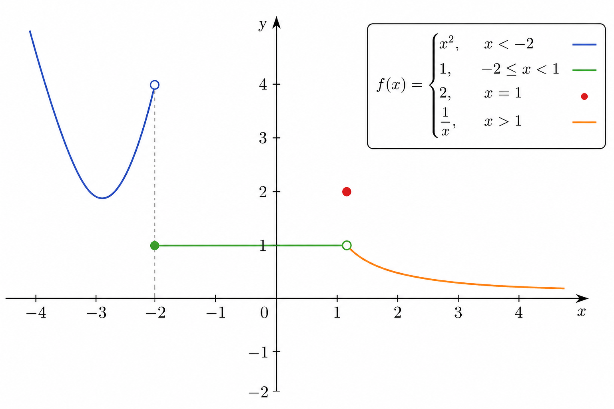
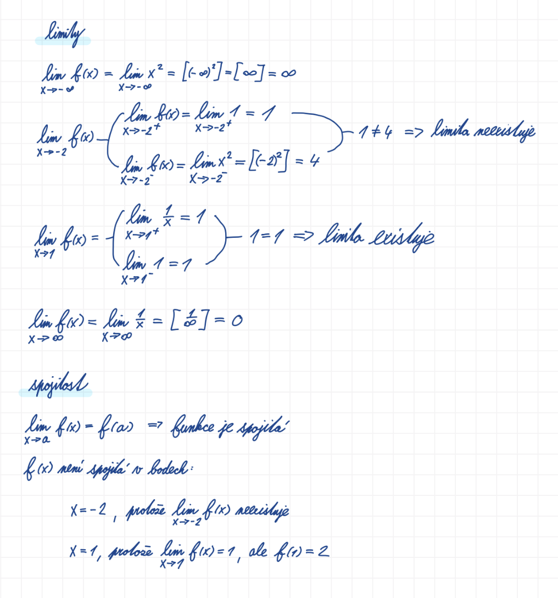
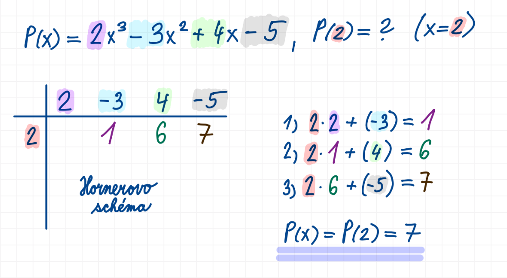

## 4

Reálná funkce jedné reálné proměnné (definice, definiční obor a obor hodnot, graf funkce, limita a spojitost funkce), polynomy (definice, vlastnosti, Hornerovo schéma), numerické řešení nelineárních rovnic (metoda půlení intervalu, Newtonova metoda)

### Užitečné odkazy
- <https://youtu.be/g4JPEa6077E?si=_RmzWPziVyOmowAX> (Definiční obor)
- <https://www.youtube.com/watch?v=u2qCu6iBnN8> (Definiční obor)
- <https://www.youtube.com/watch?v=7_vYKrVLEg8> (Definiční obor a obor hodnot)
- <https://youtu.be/z7pLs2yeo5c?si=McMxOWtg7sJ2L1nx> (Definiční obor)
- <https://www.youtube.com/watch?v=Gnfs0STbxhY> (Dělení polynomu polynomem)

### Funkce
- zobrazení mezi dvěma množinami

$$f : A \to B$$

Každému prvku z množiny $A$ přiřazuje právě jeden prvek z množiny $B$.

V kontextu funkce:
- $A$ = definiční obor
- $B$ = kodoména (cílová množina)

Skutečný obor hodnot funkce je množina všech hodnot, kterých funkce skutečně nabývá:

$$
f(A)=\{f(x)\ |\ x \in A\}
$$

Předpis funkce popisuje závislost mezi prvky definičního oboru a odpovídajícími prvky oboru hodnot. Jinými slovy určuje, jakým způsobem se z hodnoty vstupu vypočítá odpovídající hodnota výstupu.

### Reálná funkce
- funkce, jejíž definiční obor i obor hodnot jsou tvořeny reálnými čísly

$$
f : A \to B
$$

$$
A,B \subseteq \mathbb{R}
$$

Speciálním případem je:

$$
f : \mathbb{R} \to \mathbb{R}
$$

Každému reálnému číslu z definičního oboru přiřazuje právě jedno reálné číslo z oboru hodnot.

### Reálná funkce jedné proměnné
- reálná funkce, jejíž vstup je tvořen právě jednou proměnnou

$$
x \in \mathbb{R}
$$

$$
f(x) \in \mathbb{R}
$$

### Definiční obor
- množina všech hodnot vstupní proměnné, pro které je funkce definována a dokáže přiřadit odpovídající hodnotu z oboru hodnot
- intuitivně představuje všechny hodnoty na ose $x$, pro které má funkce smysl a lze vypočítat její hodnotu

$$
D(f) = \{\, x \in A \; ; \; \exists\, y \in B; f(x)=y \,\}
$$



#### Příklad
$$
f(x)=\frac{1}{x}
$$

$$
D(f)=\mathbb{R}\setminus\{0\}
$$

protože pro danou hodnotu:

$$
x=0
$$

nelze určit funkční hodnotu.

### Obor hodnot
- množina všech hodnot, kterých může funkce nabývat
- intuitivně představuje všechny hodnoty na ose $y$, které může funkce vytvořit

$$
H = \{\, y \in B \; ; \; \exists\, x \in A \; ; \; f(x)=y \,\}
$$

#### Příklad
$$
f(x)=x^2
$$
$$
H(f)=[0,\infty)
$$

protože druhá mocnina reálného čísla nikdy není záporná.

### Graf funkce
- množina všech bodů, které reprezentují funkční hodnoty dané funkce v konkrétní soustavě souřadnic (např. kartézské)

Každý bod grafu odpovídá dvojici:

$$
[x,f(x)]
$$

Graf funkce tvoří všechny body:

$$
\{[x,f(x)] \mid x \in D(f)\}
$$

### Příklad
$$
f(x)=x^2
$$
Grafem této funkce je parabola otevřená směrem nahoru.

### Limita
- číslo, ke kterému se funkce v nějakém bodě blíží
- popisuje chování funkce v okolí daného bodu, nikoliv nutně přímo v tomto bodě

$$
\lim_{x \to a} f(x)=L
$$

To znamená, že pokud se:
$$
x \to a
$$

pak se odpovídající funkční hodnoty:
$$
f(x) \to L
$$

přičemž „$\to$“ v tomto kontextu čteme jako „se blíží k“.

### Limita zleva
- hodnota, ke které se funkce blíží při přibližování k bodu $a$ zleva

$$
\lim_{x \to a^-} f(x)
$$


### Limita zprava
- hodnota, ke které se funkce blíží při přibližování k bodu $a$ zprava

$$
\lim_{x \to a^+} f(x)
$$

### Existence limity
- limita existuje právě tehdy, když existuje limita zleva i limita zprava a vychází stejně

$$
\lim_{x \to a^-} f(x)=\lim_{x \to a^+} f(x)=L
\Rightarrow
\lim_{x \to a} f(x)=L
$$

#### Příklad




### Spojitost funkce
- funkce je spojitá v bodě $a \in D(f)$, pokud limita funkce v bodě $a$ existuje a je rovna funkční hodnotě v tomto bodě

$$
\lim_{x \to a} f(x)=f(a)
$$

### Polynom
- synonymum: mnohočlen
- funkce tvořená součtem členů ve tvaru konstanty násobené nezápornou celočíselnou mocninou proměnné

Polynom je výraz ve tvaru:

$$
p(x)=\sum_{i=0}^{n} a_i x^i = a_0 + a_1x + a_2x^2 + \dots + a_nx^n
$$

kde:

- $a_0, a_1, \dots, a_n$ jsou reálná čísla (tzv. koeficienty)
- $n$ je nezáporné celé číslo
- proměnná $x$ vystupuje pouze v celočíselných nezáporných mocninách

### Stupeň polynomu
- nejvyšší exponent proměnné $x$ s nenulovým koeficientem

$$
\deg(p)
$$

#### Příklad

$$
p(x)=x^2-4
$$

$$
\deg(p)=2
$$

Polynom $p(x)$ je polynom druhého stupně.

#### Terminologie
- polynom 1. stupně = lineární polynom
- polynom 2. stupně = kvadratický polynom
- polynom 3. stupně = kubický polynom
- polynom 4. stupně = kvartický polynom
- ...

### Vlastnosti polynomu
- polynom stupně $n$ může mít maximálně $n$ kořenů
- člen s nejvyšší mocninou nejvíce ovlivňuje chování grafu

### Rovnost polynomů
Polynomy $p(x)$ a $q(x)$ jsou si rovny právě tehdy, když mají stejné koeficienty u členů se stejnými exponenty proměnné $x$.

### Operace s polynomy
- polynomy můžeme sčítat, odčítat, dělit, derivovat i násobit
- při sčítání a odčítání se sčítají koeficienty členů se stejnými exponenty
- při násobení se exponenty sčítají
- derivací polynomu vznikne opět polynom
- součinem dvou polynomů vznikne opět polynom
- součet dvou polynomů je opět polynom

### Hornerovo schéma
- efektivní způsob výpočtu hodnoty polynomu bez opakovaného počítání mocnin
- používá pouze násobení a sčítání
- vhodné pro numerické výpočty i implementaci v programu



Bez Hornerova schématu bychom hodnotu polynomu počítali přímým dosazením:

$$
P(x)=2x^3-3x^2+4x-5
$$

pro $x=2$:

$$
P(2)=2 \cdot 2^3 - 3 \cdot 2^2 + 4 \cdot 2 - 5
$$

$$
=2 \cdot 8 - 3 \cdot 4 + 8 - 5
$$

$$
=16 -12 +8 -5
$$

$$
=7
$$

Musíme zde opakovaně počítat mocniny:
- $2^2$
- $2^3$

U polynomů vysokého stupně by byl tento výpočet pomalý a numericky nevhodný, protože je nutné opakovaně počítat vysoké mocniny typu $x^n$, které mohou být výpočetně drahé, způsobovat ztrátu přesnosti a u velmi velkých hodnot vést k přetečení (overflow) nebo k práci s extrémně velkými čísly zabírajícími více paměti.

```python
def horner(coefficients: list[float], x: float) -> float:
    result = coefficients[0]

    for coefficient in coefficients[1:]:
        result = result * x + coefficient

    return result


# P(x) = 2x^3 - 3x^2 + 4x - 5, x = 2
result = horner(coefficients=[2, -3, 4, -5], x=2)
print(result)
```

### Numerické řešení nelineárních rovnic

Cílem je najít kořen rovnice ve tvaru:

$$
f(x)=0
$$

tedy hodnotu $x$, pro kterou funkce vyjde nula.

Například:

$$
x^2-2=0
$$

řešení:

$$
x=\sqrt{2}\approx1.41421356
$$

U složitých funkcí neumíme kořen spočítat přesně analyticky. Použijí se numerické metody.

#### Nelineární rovnice
- rovnice, ve které neznámá nevystupuje pouze v první mocnině a jejíž graf není přímka

### Metoda půlení intervalu
- synonymum: metoda bisekce

#### Princip

Máme interval:

$$
[a,b]
$$

ve kterém funkce změní znaménko:

$$
f(a)\cdot f(b)<0
$$

To znamená:
- na jednom konci je funkce **kladná**
- na druhém **záporná**

Takže mezi nimi musí existovat kořen.

#### Postup

1. Spočítáme střed:

$$
c=\frac{a+b}{2}
$$

2. Zjistíme znaménko:
   - pokud je kořen v $[a,c]$, zahodíme pravou část
   - jinak zahodíme levou

3. Interval stále půlíme.

#### Příklad

Najdi kořen:

$$
f(x)=x^2-2
$$

Interval:

$$
[1,2]
$$

protože:

$$
f(1)=-1
$$

$$
f(2)=2
$$

změna znaménka existuje.

#### Iterace

Střed:

$$
c=\frac{1+2}{2}=1.5
$$

Výpočet:

$$
f(1.5)=0.25
$$

Kořen je tedy vlevo:

$$
[1,1.5]
$$

Další krok:

$$
c=\frac{1+1.5}{2}=1.25
$$

atd.

```python
def bisection(f, a: float, b: float, tolerance: float = 1e-10) -> float:
    while abs(b - a) > tolerance:
        c: float = (a + b) / 2

        if f(a) * f(c) < 0:
            b = c
        else:
            a = c

    return (a + b) / 2


def f(x: float) -> float:
    return x**2 - 2


root = bisection(f=f, a=1.0, b=2.0)
print(root)
```

### Newtonova metoda
- synonymum: metoda tečen
- iterativní numerická metoda pro hledání kořene rovnice $f(x)=0$
- využívá aproximaci funkce tečnou v aktuálním bodě

#### Princip
- v bodě $x_n$ sestavíme tečnu k grafu funkce $f$
- průsečík tečny s osou $x$ bereme jako další odhad kořene $x_{n+1}$
- opakujeme, dokud není změna dostatečně malá

#### Vzorec

$$
x_{n+1} = x_n - \frac{f(x_n)}{f'(x_n)}
$$

kde:
- $x_n$ je aktuální odhad kořene
- $f(x_n)$ je hodnota funkce v bodě $x_n$
- $f'(x_n)$ je derivace funkce v bodě $x_n$

#### Podmínky použití
- musíme znát derivaci $f'(x)$
- v okolí kořene by měla platit $f'(x) \neq 0$
- počáteční odhad $x_0$ by měl být dostatečně blízko kořene (jinak metoda může divergovat)

#### Porovnání s metodou půlení intervalu

| | Metoda půlení | Newtonova metoda |
|---|---|---|
| Rychlost | pomalejší | obvykle rychlejší (kvadratická konvergence v ideálním případě) |
| Derivace | nepotřebuje | potřebuje $f'(x)$ |
| Spolehlivost | vždy konverguje při změně znaménka na intervalu | může divergovat při špatném $x_0$ |
| Počáteční podmínka | interval $[a,b]$ se změnou znaménka | počáteční bod $x_0$ |

#### Příklad

Najdi kořen:

$$
f(x)=x^2-2
$$

Derivace:

$$
f'(x)=2x
$$

Vzorec iterace:

$$
x_{n+1}=x_n-\frac{x_n^2-2}{2x_n}
$$

Počáteční odhad $x_0=2$:

$$
x_1=2-\frac{4-2}{4}=1.5
$$

$$
x_2=1.5-\frac{2.25-2}{3}\approx 1.4167
$$

Postupně se přibližujeme k $\sqrt{2}\approx 1.4142$.

```python
def newton(f, df, x0: float, tolerance: float = 1e-10, max_iter: int = 100) -> float:
    x: float = x0

    for _ in range(max_iter):
        fx: float = f(x)
        dfx: float = df(x)

        if abs(dfx) < 1e-12:
            raise ValueError("Derivace je příliš blízko nule.")

        x_next: float = x - fx / dfx

        if abs(x_next - x) < tolerance:
            return x_next

        x = x_next

    return x


def f(x: float) -> float:
    return x**2 - 2


def df(x: float) -> float:
    return 2 * x


root = newton(f=f, df=df, x0=2.0)
print(root)
```