## 5

Diferenciální a integrální počet funkcí jedné proměnné (definice derivace funkce a její geometrický význam, primitivní funkce, určitý integrál a jeho geometrický význam), numerické derivování a integrace (obdélníkové, lichoběžníkové a Simpsonovo pravidlo), aplikace (určení lokálního extrému, navazování křivek, objem rotačního tělesa)

### Užitečné odkazy
- <https://www.youtube.com/watch?v=lXZmgv8xm18> (Derivace - česky)
- <https://www.youtube.com/watch?v=ACU3tdGglmA> (Definice derivace - česky)
- <https://www.youtube.com/watch?v=cMSCIG396A8> (Graf derivace - česky)
- <https://www.youtube.com/watch?v=x1sXA43rpuI> (Definice derivace - česky)

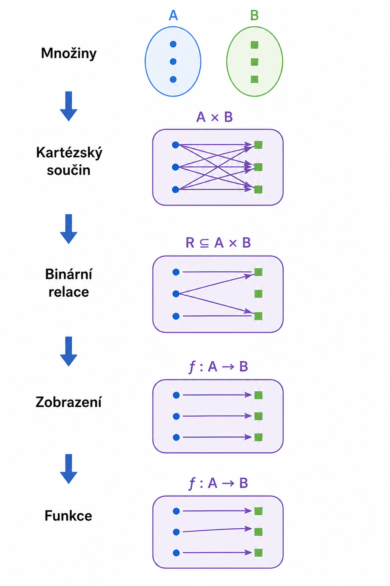

### Kartéřský součin
- kartézský součin množin $A$ a $B$ je množina všech uspořádaných dvojic, kde první prvek pochází z množiny $A$ a druhý z množiny $B$

Značí se:

$$
A \times B
$$

Definice:

$$
A \times B =
\{
(a,b)
\mid
a \in A,\; b \in B
\}
$$

#### Příklad
Mějme množiny

$$
A=\{1,2\}
$$

$$
B=\{a,b,c\}
$$

Potom

$$
A \times B =
\{
(1,a),
(1,b),
(1,c),
(2,a),
(2,b),
(2,c)
\}
$$

#### Počet prvků

Počet prvků kartézského součinu je roven součinu počtu prvků obou množin:

$$
|A \times B|
=
|A| \cdot |B|
$$

V našem případě:

$$
|A| = 2
$$

$$
|B| = 3
$$

proto:

$$
|A \times B|
=
2 \cdot 3
=
6
$$

### Binární relace
- binární relace mezi množinami $A$ a $B$ je libovolná podmnožina kartézského součinu

$$
R \subseteq A \times B
$$

tj. množina uspořádaných dvojic.

### Zobrazení
- speciální binární relace, ve které každému prvku definičního oboru odpovídá právě jeden prvek oboru hodnot

$$
f : A \to B
$$

Pro každé:

$$
x \in A
$$

existuje právě jedno:

$$
y \in B
$$

### Funkce
- zobrazení mezi dvěma množinami

$$f : A \to B$$

Každému prvku z množiny $A$ přiřazuje právě jeden prvek z množiny $B$.

V kontextu funkce:
- $A$ = definiční obor
- $B$ = kodoména (cílová množina)

Skutečný obor hodnot funkce je množina všech hodnot, kterých funkce skutečně nabývá:

$$
f(A)=\{f(x)\ |\ x \in A\}
$$

Předpis funkce popisuje závislost mezi prvky definičního oboru a odpovídajícími prvky oboru hodnot. Jinými slovy určuje, jakým způsobem se z hodnoty vstupu vypočítá odpovídající hodnota výstupu.

### Reálná funkce
- funkce, jejíž definiční obor i obor hodnot jsou tvořeny reálnými čísly

$$
f : A \to B
$$

$$
A,B \subseteq \mathbb{R}
$$

$$
f : \mathbb{R} \to \mathbb{R}
$$

Každému reálnému číslu z definičního oboru přiřazuje právě jedno reálné číslo z oboru hodnot.

### Reálná funkce jedné proměnné
- reálná funkce, jejíž vstup je tvořen právě jednou proměnnou

$$
x \in \mathbb{R}
$$

$$
f(x) \in \mathbb{R}
$$

### Primitivní funkce
- primitivní funkce k funkci $f(x)$ je taková funkce $F(x)$, jejíž derivace je rovna funkci $f(x)$

$$
F'(x) = f(x)
$$

#### Příklad

Funkce:

$$
F(x) = x^2
$$

je primitivní funkcí k $f(x)=2x$, protože její derivace je:

$$
F'(x) = 2x
$$

Proto platí:

$$
F'(x) = f(x)
$$

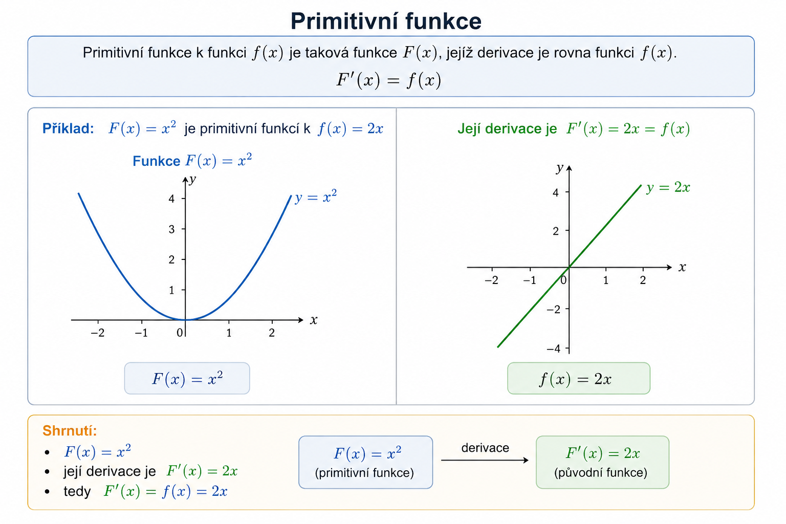

### Rostoucí funkce

Funkce $f$ je rostoucí na definičním oboru $D(f)$, pokud pro libovolná dvě čísla z definičního oboru platí:

$$
x,y \in D(f)
$$

a současně

$$
x < y
\Rightarrow
f(x) < f(y)
$$

Jinými slovy:

- když roste hodnota argumentu $x$,
- roste také hodnota funkce $f(x)$.

#### Příklad

$$
f(x)=2x
$$

Pro

$$
1 < 3
$$

platí

$$
f(1)=2
$$

$$
f(3)=6
$$

a tedy

$$
2 < 6.
$$

### Asymptota funkce
- asymptota je přímka, ke které se graf funkce neomezeně přibližuje
- vzdálenost mezi grafem funkce a asymptotou se blíží nule
- graf se asymptoty může dotýkat nebo protínat
- pro dostatečně velké hodnoty argumentu nebo v okolí určitého bodu se graf asymptotě stále více přibližuje

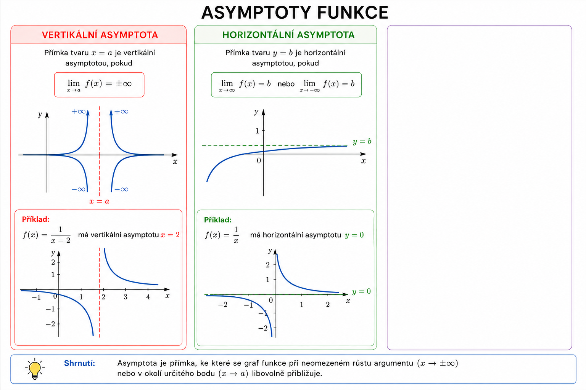

#### Vertikální asymptota
Přímka ve tvaru:

$$
x = a
$$

je vertikální asymptotou funkce, pokud platí:

$$
\lim_{x \to a} f(x) = \pm\infty
$$

#### Horizontální asymptota
Přímka ve tvaru:

$$
y = b
$$

je horizontální asymptotou funkce, pokud platí:

$$
\lim_{x \to \infty} f(x) = b
$$

nebo

$$
\lim_{x \to -\infty} f(x) = b
$$

### Limita
- číslo, ke kterému se funkce v nějakém bodě blíží
- popisuje chování funkce v okolí daného bodu, nikoliv nutně přímo v tomto bodě

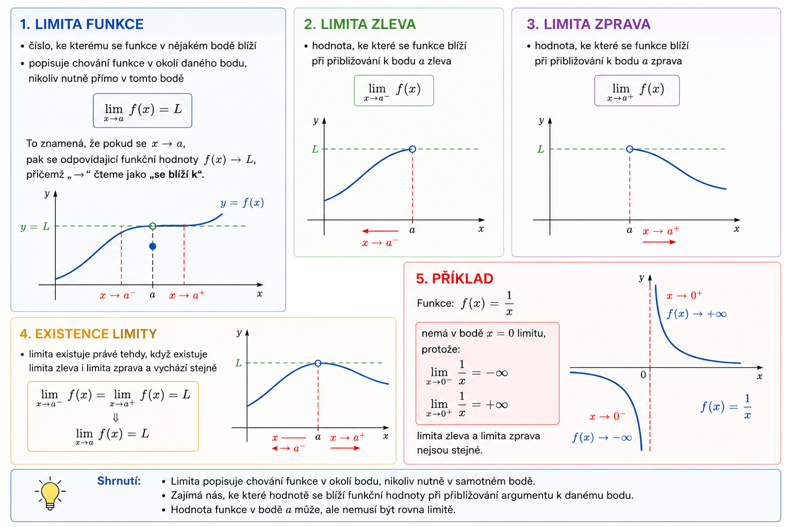

$$
\lim_{x \to a} f(x)=L
$$

To znamená, že pokud se:
$$
x \to a
$$

pak se odpovídající funkční hodnoty:
$$
f(x) \to L
$$

přičemž „$\to$“ v tomto kontextu čteme jako „se blíží k“.

### Limita zleva
- hodnota, ke které se funkce blíží při přibližování k bodu $a$ zleva

$$
\lim_{x \to a^-} f(x)
$$


### Limita zprava
- hodnota, ke které se funkce blíží při přibližování k bodu $a$ zprava

$$
\lim_{x \to a^+} f(x)
$$

### Existence limity
- limita existuje právě tehdy, když existuje limita zleva i limita zprava a vychází stejně

$$
\lim_{x \to a^-} f(x)=\lim_{x \to a^+} f(x)=L
\Rightarrow
\lim_{x \to a} f(x)=L
$$

#### Příklad

Funkce:

$$
f(x)=\frac{1}{x}
$$

nemá v bodě $x=0$ limitu, protože:

$$
\lim_{x \to 0^-} \frac{1}{x}=-\infty
$$

$$
\lim_{x \to 0^+} \frac{1}{x}=+\infty
$$

limita zleva a limita zprava nejsou stejné.

### Derivace

### Derivace elementárních funkcí
### Derivace součinu
### Derivace podílu

### Integrál
- integrace je inverzní operace derivace
- určitý / neurčitý

### Neurčitý integrál
- hledá funkci, jejíž derivace je rovna $f(x)$
- výsledkem je primitivní funkce

$$
\int f(x)\,dx = F(x) + C
$$

### Určitý integrál
- představuje obsah plochy mezi grafem funkce a osou $x$ na intervalu $\langle a,b \rangle$
- funkce musí být spojitá na intervalu $<a,b>$
- $a$ a $b$ se nazývají integrační meze
- $a$ je dolní integrační mez
- $b$ je horní integrační mez
- výsledkem je konkrétní číslo

$$
\int_a^b f(x)\,dx = \left[F(x)\right]_a^b = F(b)-F(a)
$$

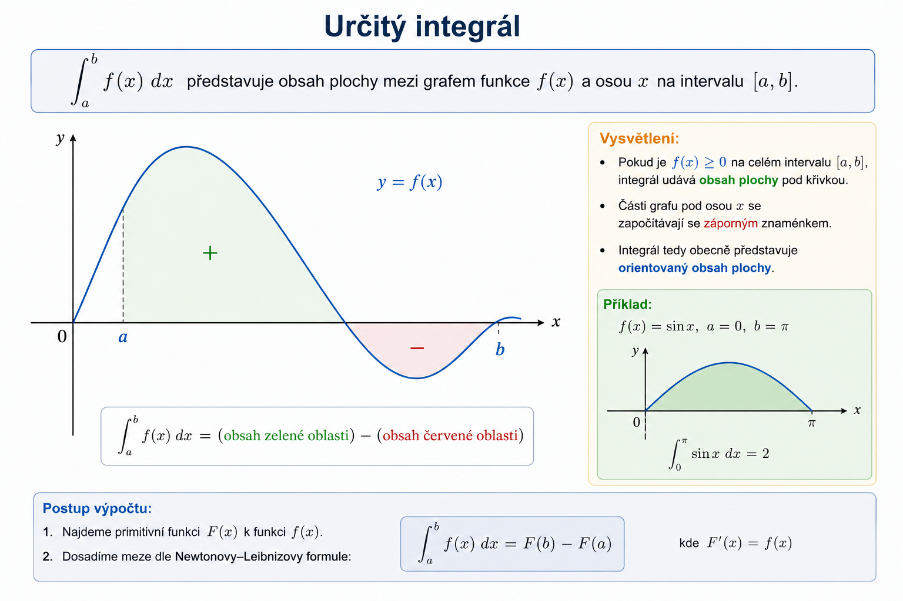

#### Geometrický význam
- rozdělím plochu pod křivkou na velmi úzké obdélníky
- spočítám jejich obsahy
- všechny obsahy sečtu
- v limitě nekonečně mnoha nekonečně úzkých obdélníků získám přesný obsah plochy pod křivkou

$$
\int_a^b f(x)\,dx
=
\lim_{n \to \infty}
\sum_{i=1}^{n}
f(x_i)\,\Delta x
$$

kde:

- $\int_a^b f(x)\,dx$ je určitý integrál funkce $f(x)$ na intervalu $<a,b>$
- $a$ je dolní integrační mez
- $b$ je horní integrační mez
- $\lim_{n \to \infty}$ znamená, že počet dílků (obdélníků) roste do nekonečna
- $n$ je počet dílků, na které rozdělíme interval $<a,b>$
- $\sum_{i=1}^{n}$ znamená, že sčítáme příspěvky od prvního do n-tého dílku
- $x_i$ je zvolený bod v i-tém dílku
- $f(x_i)$ představuje výšku i-tého obdélníku
- $\Delta x$ představuje šířku jednoho dílku (obdélníku)
- $f(x_i)\Delta x$ je obsah i-tého obdélníku

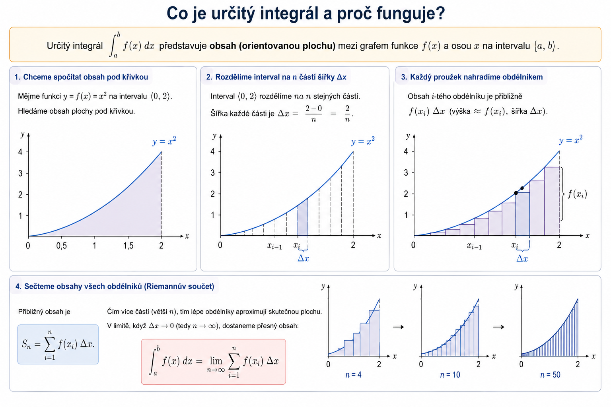

### Obdelníkové pravidlo
- numerická metoda pro přibližný výpočet určitého integrálu

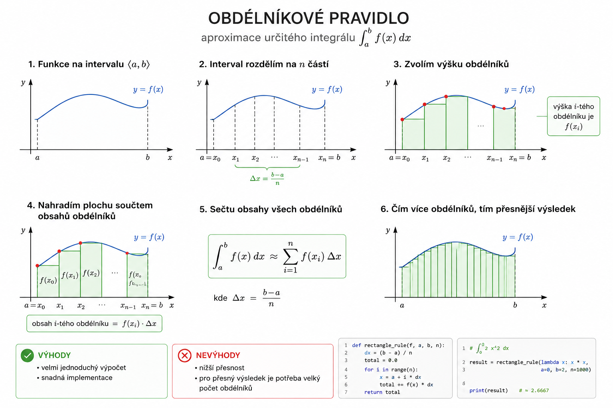

#### Princip
- interval $<a,b>$ rozdělím na $n$ stejně širokých částí
- každou část nahradím obdélníkem
- výška obdélníku je určena hodnotou funkce v daném bodě
- obsahy všech obdélníků sečtu

#### Vzorec
$$
\int_a^b f(x)\,dx
\approx
\sum_{i=1}^{n}
f(x_i)\,\Delta x
$$

kde:

$$
\Delta x = \frac{b-a}{n}
$$

#### Geometrický význam
- plochu pod křivkou aproximuji pomocí obdélníků
- čím více obdélníků použiji, tím přesnější je výsledek
- v limitě nekonečně mnoha obdélníků dostanu přesnou hodnotu integrálu

#### Výhody
- velmi jednoduchý výpočet
- snadná implementace

#### Nevýhody
- nižší přesnost
- pro přesný výsledek je potřeba velký počet obdélníků

```python
def rectangle_rule(f, a, b, n):
    dx = (b - a) / n
    total = 0.0

    for i in range(n):
        x = a + i * dx
        total += f(x) * dx

    return total
```

```python
# Aproximace určitého integrálu ∫₀² x² dx pomocí obdélníkového pravidla.
result = rectangle_rule(lambda x: x * x, a=0, b=2, n=1000)
print(result)
```

### Složené lichoběžníkové pravidlo
- numerická metoda pro přibližný výpočet určitého integrálu

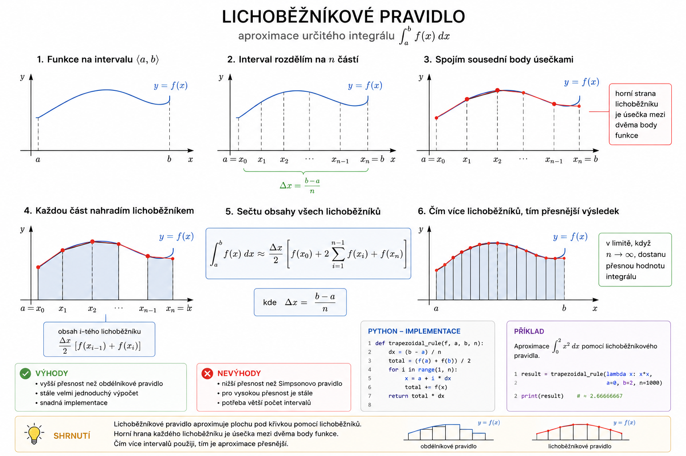

#### Princip

- interval $<a,b>$ rozdělím na $n$ stejně širokých částí
- místo obdélníků spojím sousední body funkce úsečkou
- každou část tak nahradím lichoběžníkem
- obsahy všech lichoběžníků sečtu

#### Vzorec

$$
\int_a^b f(x)\,dx
\approx
\frac{\Delta x}{2}
\left[
f(x_0)
+
2\sum_{i=1}^{n-1}f(x_i)
+
f(x_n)
\right]
$$

kde:

$$
\Delta x = \frac{b-a}{n}
$$

#### Geometrický význam

- plochu pod křivkou aproximuji pomocí lichoběžníků
- horní strana každého lichoběžníku je tvořena úsečkou mezi dvěma body funkce
- křivku tedy nenahrazuji schody jako u obdélníkového pravidla, ale lomenou čarou
- čím více lichoběžníků použiji, tím přesnější je výsledek
- v limitě nekonečně mnoha lichoběžníků dostanu přesnou hodnotu integrálu

#### Výhody

- vyšší přesnost než obdélníkové pravidlo
- stále velmi jednoduchý výpočet
- snadná implementace

#### Nevýhody

- nižší přesnost než Simpsonovo pravidlo
- pro vysokou přesnost je stále potřeba větší počet intervalů

```python
def trapezoidal_rule(f, a, b, n):
    dx = (b - a) / n

    total = (f(a) + f(b)) / 2

    for i in range(1, n):
        x = a + i * dx
        total += f(x)

    return total * dx
```

```python
# Aproximace určitého integrálu ∫₀² x² dx pomocí lichoběžníkového pravidla.
result = trapezoidal_rule(lambda x: x * x, a=0, b=2, n=1000)
print(result)
```

### Simpsonovo pravidlo
- numerická metoda pro přibližný výpočet určitého integrálu
- přesnější než obdélníkové i lichoběžníkové pravidlo

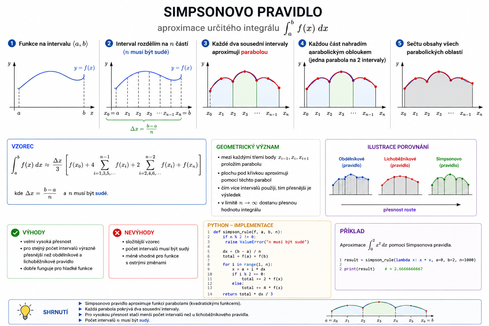

#### Princip
- interval $<a,b>$ rozdělím na sudý počet částí
- místo obdélníků nebo lichoběžníků aproximuji funkci parabolou
- každé dva sousední intervaly nahradím jednou kvadratickou funkcí
- obsahy vzniklých oblastí sečtu

#### Vzorec

$$
\int_a^b f(x)\,dx
\approx
\frac{\Delta x}{3}
\left[
f(x_0)
+
4\sum_{i=1,3,5,\dots}^{n-1}f(x_i)
+
2\sum_{i=2,4,6,\dots}^{n-2}f(x_i)
+
f(x_n)
\right]
$$

kde

$$
\Delta x=\frac{b-a}{n}
$$

a $n$ musí být sudé.

#### Geometrický význam

- křivku neaproximuji obdélníky ani úsečkami
- mezi body funkce prokládám paraboly
- plochu pod křivkou aproximuji pomocí těchto parabol
- čím více intervalů použiji, tím přesnější je výsledek

#### Výhody

- velmi vysoká přesnost
- pro stejný počet intervalů bývá výrazně přesnější než obdélníkové a lichoběžníkové pravidlo
- dobře funguje pro hladké funkce

#### Nevýhody

- složitější vzorec
- počet intervalů musí být sudý
- méně vhodné pro funkce s ostrými změnami

```python
def simpson_rule(f, a, b, n):
    if n % 2 != 0:
        raise ValueError("n musí být sudé")

    dx = (b - a) / n

    total = f(a) + f(b)

    for i in range(1, n):
        x = a + i * dx

        if i % 2 == 0:
            total += 2 * f(x)
        else:
            total += 4 * f(x)

    return total * dx / 3
```

```python
# Aproximace určitého integrálu ∫₀² x² dx pomocí Simpsonova pravidla.
result = simpson_rule(lambda x: x * x, a=0, b=2, n=1000)
print(result)
```

#### Určení lokálního extrému

1. Spočítám první derivaci.
2. Vyřeším rovnici $f'(x)=0$.
3. Zkoumám změnu znaménka derivace.

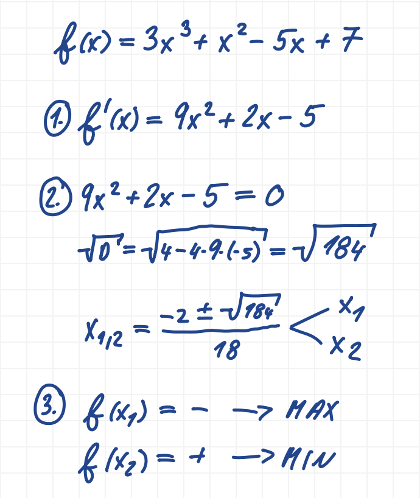

$$
+ \rightarrow - \Rightarrow \text{lokální maximum}
$$

$$
- \rightarrow + \Rightarrow \text{lokální minimum}
$$

### Navazování křivek

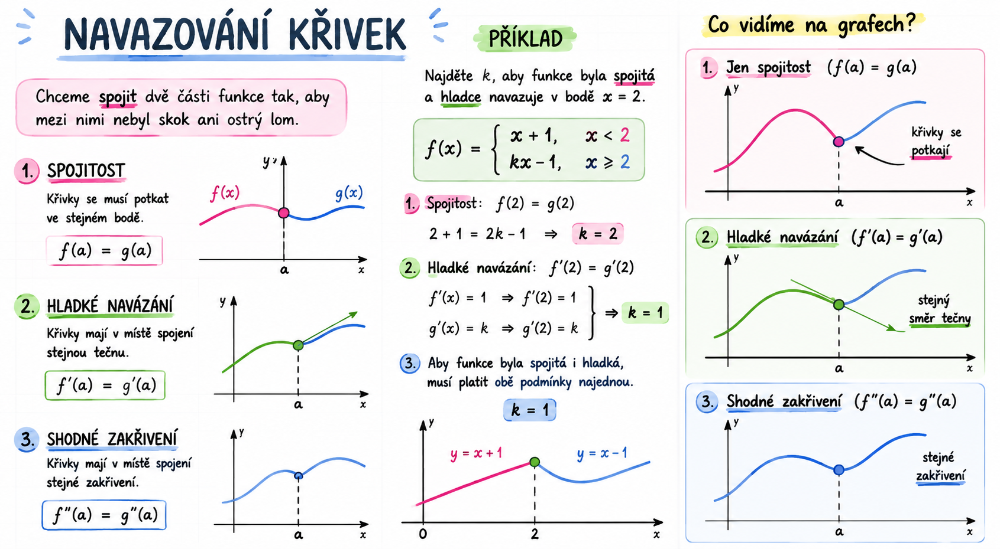

### Objem rotačního tělesa

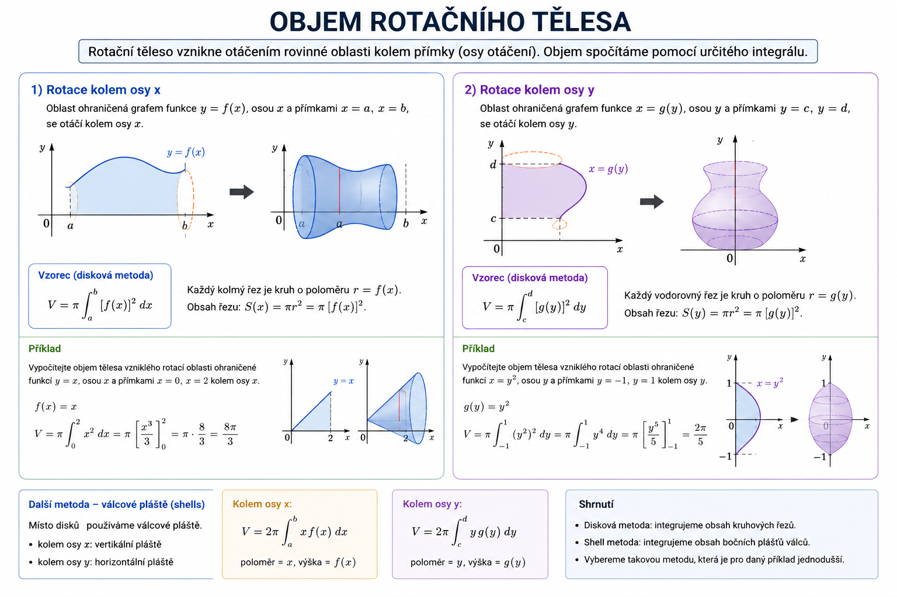