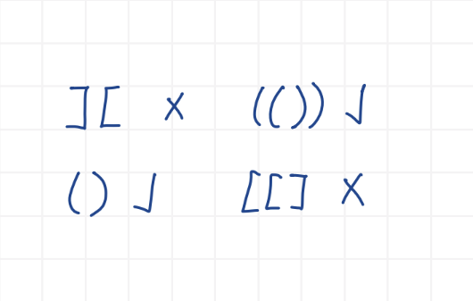
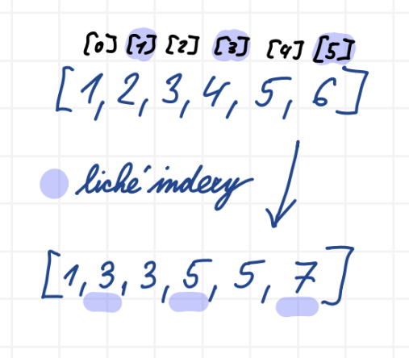
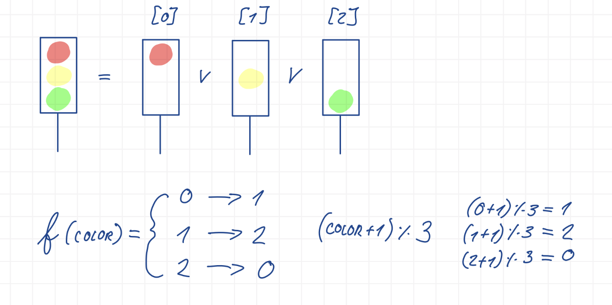

## Algoritmizace a programování I a II

### Užitečné odkazy
- <https://physics.ujep.cz/~jskvor/SZZ/BcAPI/SZZPP/Tahaky/APR-Python.pdf> (Povolený tahák)

### Programování: funkce a cykly
- literály základních tříd (int, float, bool, string), metody/operace základních tříd
- import balíčků, základní balíčky (math, random)
- proměnné, přiřazení
- podmíněné příkazy (if:elif:else)
- interpolace řetězců se základním formátováním (f"")
- cykly (for, while)
- vlastní funkce (poziční a pojmenované parametry, příkaz return)
- vyvolávání výjimek
- vstup a výstup na konzoli (print, input)

#### Řešení ukázkové úlohy
```python
def test_of_parentheses(text: str, parentheses: tuple[str, str]) -> bool:
    if not text.strip():
        raise ValueError("Text is empty")

    left, right = parentheses
    count = 0

    for character in text:
        if character == left:
            count += 1
        elif character == right:
            count -= 1
        
        if count < 0:
            return False

    return count == 0
```



### Programování: kolekce
- literály základních tříd (int, float, bool, string), metody/operace základních tříd
- import balíčků, základní balíčky (math, random)
- proměnné, přiřazení
- podmíněné příkazy (if:elif:else)
- interpolace řetězců se základním formátováním (f"")
- cykly (for, while)
- základní kolekce (seznamy, slovník) a jejich metody a literály
- vyvolávání výjimek
- vstup a výstup na konzoli (print, input)

#### Řešení ukázkové úlohy

```python
def increment_even(data: list) -> list:
    new_data = []

    for index, item in enumerate(data):
        if not isinstance(item, int):
            raise TypeError("Item is not a number")
            
        new_data.append(item + index % 2)

    return new_data
```



### Programování: základy OOP
- literály základních tříd (int, float, bool, string), metody/operace základních tříd
- import balíčků, základní balíčky (math, random)
- proměnné, přiřazení
- podmíněné příkazy (if:elif:else)
- interpolace řetězců se základním formátováním (f"")
- vlastní jednoduché třídy (konstruktor, metody, speciální metoda __str/repr__. __contains__)
- vyvolávání výjimek
- vstup a výstup na konzoli (print, input)

#### Řešení ukázkové úlohy

```python
class Semaphore:
    colors = ["red", "yellow", "green"]

    def __init__(self, color: str):
        if color not in Semaphore.colors:
            raise ValueError("Unsupported color")
        self.color = color

    @property
    def stop(self):
        return self.color in ("red", "yellow")

    def __str__(self):
        return self.color

    def __eq__(self, other: "Semaphore"):
        return self.color == other.color

    def __iter__(self):
        return self

    def __next__(self):
        index = self.colors.index(self.color)
        self.color = self.colors[(index + 1) % len(self.colors)]
        return self
```

