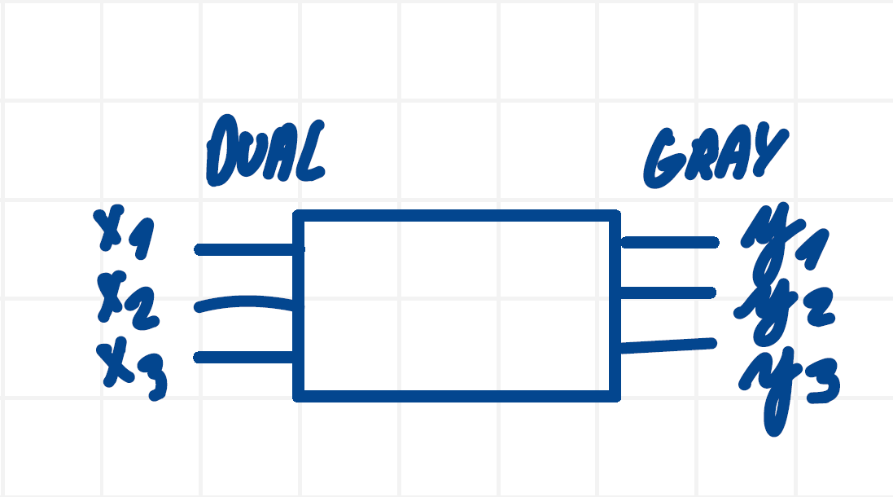
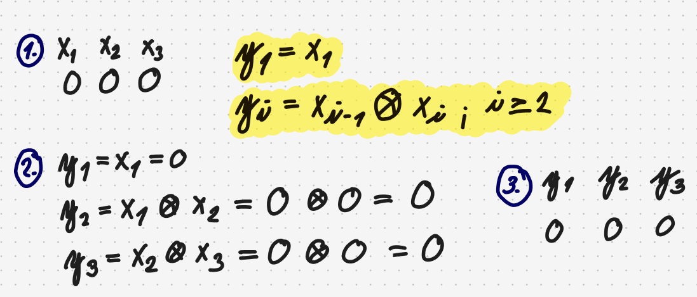
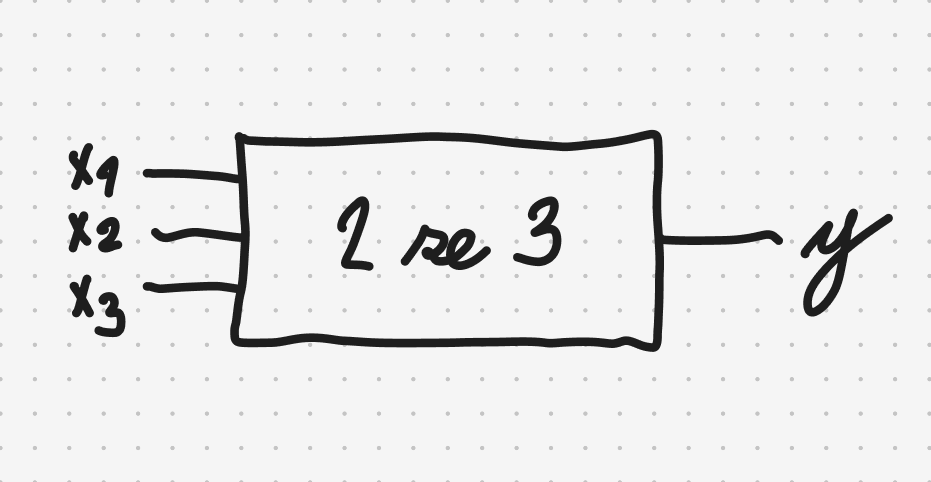
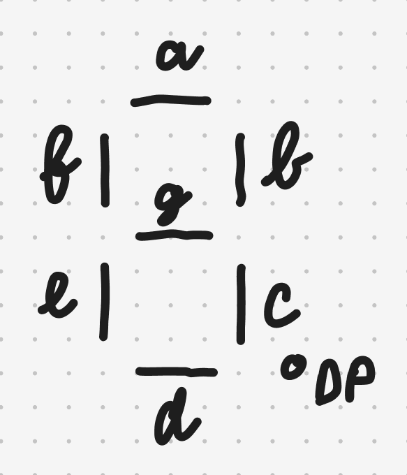
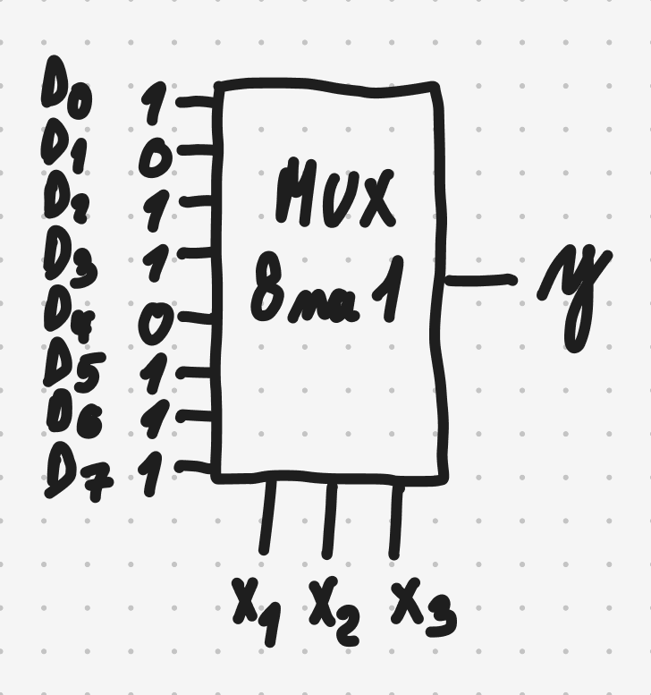
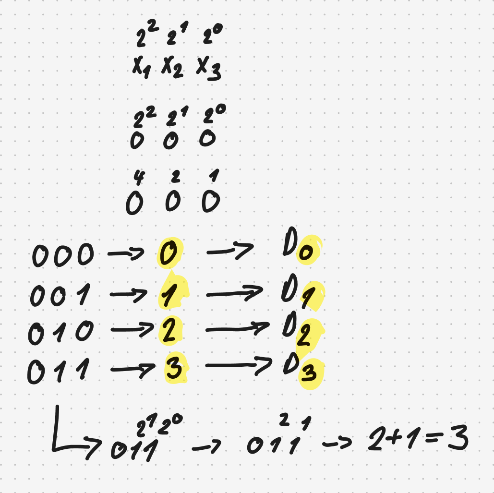

## Základy elektroniky
- rozumět funkci logických hradel (AND, OR, NOT, NAND, NOR, XOR, XNOR)
- umět sestavit pravdivostní tabulku
- umět pracovat s Karnaughovou mapou
- minimalizovat pomocí Karnaughovy mapy a pomocí algoritmu Quine-McCluskey (včetně skupinové minimalizace)
- umět nakreslit schéma logické funkce
- chápat zapojení sedmisegmentového displeje s jednou cifrou (například typ 5161AS 0.56' společná katoda)
- umět používat dekodér
- umět používat multiplexor

### Užitečné odkazy
- <https://www.laskakit.cz/sedmisegmentovy-0-56--displej--spolecna-katoda--cerveny> (7segmentový displej)

### Obecné poznatky
- u většiny úloh budou max. 3-4 vstupní proměnné (spíše 3)
- pokud bude povaha úlohy triviální, tak 4 vstupní proměnné
- např. u metody McClusky budou velmi pravděpodobně 3 vstupní proměnné
- oblíbené zadání zkoušejícího (Dual dekodér na Gray), tedy velmi vysoká pravděpodobnost výskytu
- žádné jiné kombinace než Dual, Gray a M z N se nevyskytnou
- u M z N je vysoká pravděpodobnost, že se vyskytne 2 ze 3 (přičemž N bude velmi pravděpodobně vždy 3 a M bude 0, 1, nebo 2)

### AND
Výstup je $1$ pouze tehdy, když jsou všechny vstupy $1$.

$$
f = x_1 \land x_2
$$

| x₁ | x₂ | f |
|---|---|---|
| 0 | 0 | 0 |
| 0 | 1 | 0 |
| 1 | 0 | 0 |
| 1 | 1 | 1 |

### OR
Výstup je $1$, pokud je alespoň jeden vstup $1$.

$$
f = x_1 \lor x_2
$$

| x₁ | x₂ | f |
|---|---|---|
| 0 | 0 | 0 |
| 0 | 1 | 1 |
| 1 | 0 | 1 |
| 1 | 1 | 1 |

### NOT
Invertuje vstup.

$$
f = \neg x
$$

| x | f |
|---|---|
| 0 | 1 |
| 1 | 0 |

### NAND
Negace AND.

$$
f = \neg (x_1 \land x_2)
$$

| x₁ | x₂ | f |
|---|---|---|
| 0 | 0 | 1 |
| 0 | 1 | 1 |
| 1 | 0 | 1 |
| 1 | 1 | 0 |

### NOR
Negace OR.

$$
f = \neg (x_1 \lor x_2)
$$

| x₁ | x₂ | f |
|---|---|---|
| 0 | 0 | 1 |
| 0 | 1 | 0 |
| 1 | 0 | 0 |
| 1 | 1 | 0 |

### XOR
Výstup je $1$, pokud jsou vstupy různé.

$$
f = x_1 \oplus x_2
$$

| x₁ | x₂ | f |
|---|---|---|
| 0 | 0 | 0 |
| 0 | 1 | 1 |
| 1 | 0 | 1 |
| 1 | 1 | 0 |

### XNOR
Výstup je $1$, pokud jsou vstupy stejné.

$$
f = \neg (x_1 \oplus x_2)
$$

| x₁ | x₂ | f |
|---|---|---|
| 0 | 0 | 1 |
| 0 | 1 | 0 |
| 1 | 0 | 0 |
| 1 | 1 | 1 |

### Pravdivostní tabulka

Pravdivostní tabulka popisuje všechny možné kombinace vstupů a jejich odpovídající výstup.

Každý řádek reprezentuje jednu konkrétní kombinaci hodnot vstupních proměnných.

Počet řádků pravdivostní tabulky určuje vztah: $2^n$

kde:
- $n$ je počet vstupních proměnných

Například:
- pro $n=1$ existují $2^1=2$ kombinace
- pro $n=2$ existují $2^2=4$ kombinace
- pro $n=3$ existují $2^3=8$ kombinací

Obecný tvar pravdivostní tabulky:

| i | x₁ | x₂ | ... | xₙ | f |
|---|---|---|---|---|---|
| 0 | 0 | 0 | ... | 0 | ? |
| 1 | 0 | 0 | ... | 1 | ? |
| 2 | 0 | 1 | ... | 0 | ? |
| . | . | . | ... | . | . |
| . | . | . | ... | . | . |
| . | . | . | ... | . | . |

kde:
- $i$ je index řádku
- $x_1 \dots x_n$ jsou vstupní proměnné
- $f$ je výstupní funkce

### Kombinační obvod
- obvod, kde na vstupu je nějaká kombinace a generuje na výstupu nějakou kombinaci
- např. na vstupu to mohou být tlačítka a na výstupu diody, které se mají rozvítit

### Příklad kombinačního obvodu
*Navrhněte kombinační obvod zadaný funkcí $f(2,3,5,6)$.*

#### 1. Schéma

Kombinační obvod můžeme obecně znázornit jako blok, do kterého vstupují vstupní proměnné a na základě jejich kombinace vzniká výstupní funkce $f$.

V tomto případě:
- $x_1, x_2, x_3$ jsou vstupy
- $y=f$ je výstup obvodu

Laicky řečeno:
- 3 proměnné = 3 vstupní nožičky
- 1 výstup = 1 výstupní nožička

#### 2. Pravdivostní tabulka

Funkce $f$ říká, na jakém indexu jsou jedničky na výstupu. Protože nejvyšší index je $6$, celkový počet indexů bude $2^3 = 8$, protože pro tři vstupní proměnné existuje celkem $2^3$ různých kombinací nul a jedniček. Indexy píšeme od 0, tedy v tomto případě $0$-$7$. Ptám se kolik musím mít proměnných, abych měl v pravdivostní tabulce alespoň index 6 - resp. na kolikátou musím umocnit dvojku, aby vyšlo číslo alespoň 6. Výjde 3 (proto $2^3$), protože třetí mocnina dvojky je nejblíže číslu 6.

Dle $f(2,3,5,6)$ jsou jedničky na výstupu na indexech $2$, $3$, $5$:
- $i$ ... index
- $x_n$ ... vstupy
- $y=f$ ... výstup

| i | x₁ | x₂ | x₃ | f      |
|---|----|----|----|--------|
| 0 |    |    |    |        |
| 1 |    |    |    |        |
| 2 |    |    |    | **1**  |
| 3 |    |    |    | **1**  |
| 4 |    |    |    |        |
| 5 |    |    |    | **1**  |
| 6 |    |    |    | **1**  |
| 7 |    |    |    |        |

Vyplňování hodnot u proměnných ($x₁$, $x₂$, $x₃$) se řídí jednoduchými pravidly:

1. U první proměnné ($x₁$) vyplníme první polovinu indexů nulami, druhou polovinu jedničkami. Protože máme $8$ řádků, zapíšeme nejprve $4$ nuly a potom $4$ jedničky.
2. U druhé proměnné ($x₂$) střídáme hodnoty po čtvrtinách tabulky. Zapíšeme tedy $2$ nuly, $2$ jedničky a tento vzor opakujeme.
3. U třetí proměnné ($x₃$) střídáme nuly a jedničky po jednom řádku. Zapíšeme tedy $1$ nulu, $1$ jedničku a tento vzor opakujeme.

Každá další proměnná střídá hodnoty dvakrát rychleji než předchozí. Poslední proměnná se mění na každém řádku. První proměnná se mění nejpomaleji.

| i | x₁ | x₂ | x₃ | f |
|---|----|----|----|---|
| 0 | 0  | 0  | 0  | 0 |
| 1 | 0  | 0  | 1  | 0 |
| 2 | 0  | 1  | 0  | 1 |
| 3 | 0  | 1  | 1  | 1 |
| 4 | 1  | 0  | 0  | 0 |
| 5 | 1  | 0  | 1  | 1 |
| 6 | 1  | 1  | 0  | 1 |
| 7 | 1  | 1  | 1  | 0 |

Existuje dokonce univerzální uzavřený vzorec, který nám řekne, po kolika řádcích se mají hodnoty $0$ a $1$ střídat:

$$
2^{n-k}
$$

kde:
- $n$ je celkový počet vstupních proměnných
- $k$ je pořadí proměnné zleva

Tento vzorec tedy určuje velikost bloku stejných hodnot.

Například pro:
- $n = 3$
- $k = 1$

dostaneme:

$$
2^{3-1} = 2^2 = 4
$$

To znamená, že pokud máme $3$ proměnné a zajímá nás jak má být velký blok stejných hodnot u $1$. proměnné, tak výjde $4$, takže budeme psát $4$ nuly, $4$ jedničky.

### Dekodér
- kombinační obvod, jehož účelem je převést jeden vstup na druhý

### Dual dekodér na Gray

#### Příklad
Navrhněte dekodér Dual na Gray (3 bity).

#### 1. Schéma

*Máme tedy 3 vstupní nožičky, do kterých vstupuje Dual, a 3 výstupní nožičky, ze kterých vystupuje Gray.*

#### 2. Pravdivoství tabulka

| i | x₁ | x₂ | x₃ | y₁ | y₂ | y₃ |
|---|---|---|---|---|---|---|
| 0 | 0 | 0 | 0 | 0 | 0 | 0 |
| 1 | 0 | 0 | 1 | 0 | 0 | 1 |
| 2 | 0 | 1 | 0 | 0 | 1 | 1 |
| 3 | 0 | 1 | 1 | 0 | 1 | 0 |
| 4 | 1 | 0 | 0 | 1 | 1 | 0 |
| 5 | 1 | 0 | 1 | 1 | 1 | 1 |
| 6 | 1 | 1 | 0 | 1 | 0 | 1 |
| 7 | 1 | 1 | 1 | 1 | 0 | 0 |

Pro každý řádek pravdivostní tabulky:
1. dosadíme konkrétní hodnoty vstupů $x_1$, $x_2$, $x_3$
2. použijeme obecné vztahy pro převod
3. vypočítáme jednotlivé výstupní bity $y_1$, $y_2$, $y_3$

Obecné vztahy jsou:

$$
y_1 = x_1
$$

$$
y_i = x_{i-1} \oplus x_i
\qquad \text{pro } i \ge 2
$$

Tímto způsobem postupně vypočítáme všechny řádky pravdivostní tabulky. Zde je příklad pro řádek na 0. indexu pravdivostní tabulky:

První bit se vždy pouze opíše, všechny další bity jsou XOR dvou sousedních bitů.

### M z N dekodér
Navrhněte dekodér M z N (2 ze 3) (3 bity). 

#### 1. Schéma

#### 2. Pravdivoství tabulka

| i | x₁ | x₂ | x₃ | y |
|---|---|---|---|---|
| 0 | 0 | 0 | 0 | 0 |
| 1 | 0 | 0 | 1 | 0 |
| 2 | 0 | 1 | 0 | 0 |
| 3 | 0 | 1 | 1 | 1 |
| 4 | 1 | 0 | 0 | 0 |
| 5 | 1 | 0 | 1 | 1 |
| 6 | 1 | 1 | 0 | 1 |
| 7 | 1 | 1 | 1 | 0 |

Výstupní nožička ($y$) svítí právě tehdy, když právě/alespoň 2 ze 3 vstupních nožiček ($x₁$, $x₂$,, $x₃$) svítí najednou.

Napsal jsem "právě/alespoň" proto, že záleží na záměru součástky. Pokud není záměr v zadání explicitně zadán, doporučuji implicitně vybrat buď variantu "právě", nebo "alespoň", a pak to zkoušejícímu explicitně oznámit. Další vhodnou variantou je doptat se na záměr, nicméně první varianta působí více sebevědomě, protože jako autoři součástky uděláte vědomé rozhodnutí a nedelegujete rozhodování na zkoušejícího.

Další možné varianty zadání:
- 0 ze 3
- 1 ze 3
- 2 ze 3

### 7segmentový displej s jednou cifrou
- čára = LED segment
- jednotlivé segmenty se rozsvěcí přivedením logické hodnoty, záleží však na konkrétním typu displeje:
    - společná katoda → segment rozsvítí logická $1$ 
    - společná anoda → segment rozsvítí logická $0$
    - (u zkoušky ale stačí říct, jak bude fungovat náš imaginární 7segmentový displej)
- ve skutečnosti je segmentů ale 8:
    - a
    - b
    - c
    - d
    - e
    - f
    - g
    - desetinná tečka (dp = decimal point)
- reálně se tedy jedná o 8segmentový displej, ale 8. segment je jen kulatá tečka, takže se do názvu nepočítá
- označení „7segmentový“ vzniklo proto, že hlavním účelem displeje je zobrazování číslic, které používají právě sedm hlavních segmentů

### Dual dekodér na 7segment. displej
*Navrhněte dekodér Dual na 7segment. displej (3 bit).*

### Kaurnaughova mapa
#### Minimalizace
### Algoritmus Quine-McCluskey
#### minterm
#### implicant
#### prime implicant
#### don't cares

### Gray dekodér

### Gray dekodér na 7segment. displej
Navrhněte dekodér Gray na 7segment. displej (3 bit).

### Multiplexor
- kombinační obvod, který vybírá jeden z více vstupů a přepošle jej na výstup

#### Příklad
*Navrhněte multiplexor 8 na 1 (8 vstupů, 1 výstup).*

Multiplexor 8 na 1 má osm vstupních nožiček (D0-D8), tři výběrové nožičky (x1, x2, x3) a jednu výstupní (y).

Výběrové vstupy tvoří binární číslo, které určuje, který vstup se přepošle na výstup.

Protože:

$$
2^3 = 8
$$

pomocí tří bitů dokážeme vybrat jeden z osmi vstupů.

Například:

| $x_1x_2x_3$ | Vybraný vstup |
|---|---|
| 000 | $D_0$ |
| 001 | $D_1$ |
| 010 | $D_2$ |
| 011 | $D_3$ |
| 100 | $D_4$ |
| 101 | $D_5$ |
| 110 | $D_6$ |
| 111 | $D_7$ |

Multiplexor funguje jako elektronický přepínač.

Na vstupu jsou připravená data:
- $D_0 \dots D_7$
- - ty si můžeme zvolit jak chceme, protože v realitě ty hodnoty většinou přicházejí z jiného obvodu

a binární číslo (v tomto případě o délce 3) na výběrových vstupech říká:
> „Který vstup mám právě poslat na výstup?“

