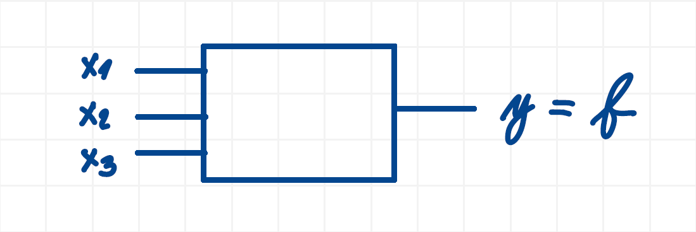

## Základy elektroniky
- rozumět funkci logických hradel (AND, OR, NOT, NAND, NOR, XOR, XNOR)
- umět sestavit pravdivostní tabulku
- umět pracovat s Karnaughovou mapou
- minimalizovat pomocí Karnaughovy mapy a pomocí algoritmu Quine-McCluskey (včetně skupinové minimalizace)
- umět nakreslit schéma logické funkce
- chápat zapojení sedmisegmentového displeje s jednou cifrou (například typ 5161AS 0.56' společná katoda)
- umět používat dekodér
- umět používat multiplexor

### Užitečné odkazy

### AND
### OR
### NOT
### NAND
### NOR
### XOR
### XNOR

### Pravdivostní tabulka

### Kombinační obvod
- obvod, kde na vstupu je nějaká kombinace a generuje na výstupu nějakou kombinaci
- např. na vstupu to mohou být tlačítka a na výstupu diody, které se mají rozvítit

### Příklad kombinačního obvodu
Navrhněte kombinační obvod zadaný funkcí $f(2,3,5,6)$

#### 1. Pravdivostní tabulka

Funkce $f$ říká, na jakém indexu jsou jedničky na výstupu. Protože nejvyšší index je $6$, celkový počet indexů bude $2^3 = 8$, protože pro tři vstupní proměnné existuje celkem $2^3$ různých kombinací nul a jedniček. Indexy píšeme od 0, tedy v tomto případě $0$-$7$. Ptám se kolik musím mít proměnných, abych měl v pravdivostní tabulce alespoň index 6 - resp. na kolikátou musím umocnit dvojku, aby vyšlo číslo alespoň 6. Výjde 3 (proto $2^3$), protože třetí mocnina dvojky je nejblíže číslu 6.

Dle $f(2,3,5,6)$ jsou jedničky na výstupu na indexech $2$, $3$, $5$:
- $i$ ... index
- $x_n$ ... vstupy
- $y=f$ ... výstup

| i | x₁ | x₂ | x₃ | f      |
|---|----|----|----|--------|
| 0 |    |    |    |        |
| 1 |    |    |    |        |
| 2 |    |    |    | **1**  |
| 3 |    |    |    | **1**  |
| 4 |    |    |    |        |
| 5 |    |    |    | **1**  |
| 6 |    |    |    | **1**  |
| 7 |    |    |    |        |

Vyplňování hodnot u proměnných ($x₁$, $x₂$, $x₃$) se řídí jednoduchými pravidly:

1. U první proměnné ($x₁$) vyplníme první polovinu indexů nulami, druhou polovinu jedničkami. Protože máme $8$ řádků, zapíšeme nejprve $4$ nuly a potom $4$ jedničky.
2. U druhé proměnné ($x₂$) střídáme hodnoty po čtvrtinách tabulky. Zapíšeme tedy $2$ nuly, $2$ jedničky a tento vzor opakujeme.
3. U třetí proměnné ($x₃$) střídáme nuly a jedničky po jednom řádku. Zapíšeme tedy $1$ nulu, $1$ jedničku a tento vzor opakujeme.

Každá další proměnná střídá hodnoty dvakrát rychleji než předchozí. Poslední proměnná se mění na každém řádku. První proměnná se mění nejpomaleji.

| i | x₁ | x₂ | x₃ | f |
|---|----|----|----|---|
| 0 | 0  | 0  | 0  | 0 |
| 1 | 0  | 0  | 1  | 0 |
| 2 | 0  | 1  | 0  | 1 |
| 3 | 0  | 1  | 1  | 1 |
| 4 | 1  | 0  | 0  | 0 |
| 5 | 1  | 0  | 1  | 1 |
| 6 | 1  | 1  | 0  | 1 |
| 7 | 1  | 1  | 1  | 0 |

Existuje dokonce univerzální uzavřený vzorec, který nám řekne, po kolika řádcích se mají hodnoty $0$ a $1$ střídat:

$$
2^{n-k}
$$

kde:
- $n$ je celkový počet vstupních proměnných
- $k$ je pořadí proměnné zleva

Tento vzorec tedy určuje velikost bloku stejných hodnot.

Například pro:
- $n = 3$
- $k = 1$

dostaneme:

$$
2^{3-1} = 2^2 = 4
$$

To znamená, že pokud máme $3$ proměnné a zajímá nás jak má být velký blok stejných hodnot u $1$. proměnné, tak výjde $4$, takže budeme psát $4$ nuly, $4$ jedničky. 

#### 2. Schéma

Kombinační obvod můžeme obecně znázornit jako blok, do kterého vstupují vstupní proměnné a na základě jejich kombinace vzniká výstupní funkce $f$.

V tomto případě:
- $x_1, x_2, x_3$ jsou vstupy
- $y=f$ je výstup obvodu

Laicky řečeno:
- 3 proměnné = 3 vstupní nožičky
- 1 výstup = 1 výstupní nožička

### Kaurnaughova mapa

#### Minimalizace

### Algoritmus Quine-McCluskey

#### minterm
#### implicant
#### prime implicant
#### don't cares

### Schéma logické funkce

### 7segmentový displej s jednou cifrou

#### 5161AS 0.56' společná katoda

### Dekodér
- kombinační obvod, jehož účelem je převést jeden vstup na druhý

### M z N dekodér
Navrhněte dekodér M z N (2 ze 3) (3 bity). 

### Gray dekodér

### Gray dekodér na 7segment. displej
Navrhněte dekodér Gray na 7segment. displej (3 bit).

### Dual dekodér na 7segment. displej
Navrhněte dekodér Dual na 7segment. displej (3 bit).

### Dual dekodér na Gray

#### Příklad
Navrhněte dekodér Dual na Gray (3 bity).

### Multiplexor

#### Příklad
Navrhněte multiplexor 8 na 1 (8 vstupů, 1 výstup)