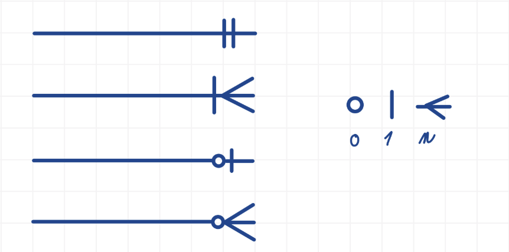

## Úvod do relačních databází
- konceptuální návrh: entity, atributy, relační vztahy (pasivně)
- logický návrh: relace 1:1, 1:N, M:N a jejich rozklad, normalizace (1-3 normální forma), E-R diagram (vraní nohy)
- fyzický návrh: příkaz CREATE TABLE, základní domény (číselné, řetězcové, časové), základní omezení (primární a cizí klíče, NOT NULL, UNIQUE)
- manipulace s daty: vkládání INSERT INTO
- dotazy: příkaz SELECT, vnitřní a vnější spojení (FROM [INNER/LEFT/RIGHT] JOIN), selekce (WHERE), projekce (SELECT)
- řazení (ORDER BY)
- seskupování (GROUP BY)

### Užitečné odkazy
- <https://physics.ujep.cz/~jskvor/SZZ/BcAPI/SZZPP/Tahaky/URDB-SQL.pdf> (Povolený tahák)
- <https://www.youtube.com/watch?v=Oxda-LTLTOc> (Vraní nohy - v angličtině)

### 1:1
- vztah typu jedna ku jedné
- jednomu záznamu první entity odpovídá právě jeden záznam druhé entity

### 1:N
- vztah typu jedna ku mnoho
- jednomu záznamu první entity odpovídá alespoň jeden záznam druhé entity

### M:N
- vztah typu mnoho ku mnoho
- jednomu záznamu první entity může odpovídat více záznamů druhé entity
- jednomu záznamu druhé entity může odpovídat více záznamů první entity
- realizuje se pomocí spojovací (vazební) tabulky

### 1 NF
- každý sloupec obsahuje pouze atomické (nedělitelné) hodnoty
- žádné seznamy, pole nebo více hodnot v jedné buňce
- každý řádek je jednoznačně identifikovatelný

Prakticky:
- jedna buňka = jedna hodnota
- žádné seznamy typu "DB, ALG, OS" v jednom sloupci

Špatně:

| Student | Předměty |
|----------|----------|
| Pepa | DB, ALG, OS |

Správně:

| Student | Předmět |
|----------|----------|
| Pepa | DB |
| Pepa | ALG |
| Pepa | OS |

Zapamatování:
> 1NF = žádné seznamy v buňkách

### 2 NF
- musí splňovat 1NF
- každý neklíčový atribut závisí na celém primárním klíči
- řeší částečné závislosti u složených klíčů

Prakticky:
- údaje mají být u toho, čeho se týkají
- neopakovat stejné informace zbytečně dokola

Špatně:

| StudentID | Předmět | Jméno studenta |
|------------|----------|----------------|
| 1 | DB | Pepa |
| 1 | ALG | Pepa |
| 1 | OS | Pepa |

Problém:
- jméno studenta se zbytečně opakuje v každém řádku

Správně:

**Student**

| StudentID | Jméno |
|------------|--------|
| 1 | Pepa |

**Zápis**

| StudentID | Předmět |
|------------|----------|
| 1 | DB |
| 1 | ALG |
| 1 | OS |

Zapamatování:
> 2NF = neopakuj stejné údaje

### 3 NF
- musí splňovat 2NF
- žádná tranzitivní závislost
- neklíčové atributy nesmí záviset na jiných neklíčových atributech

Prakticky:
- každá informace má být uložená jen jednou
- neukládat údaje, které lze jednoznačně odvodit z jiných údajů

Špatně:

| PSČ | Město |
|------|--------|
| 60200 | Brno |
| 60200 | Brno |
| 60200 | Brno |
| 11000 | Praha |
| 11000 | Praha |

Problém:
- město je určeno PSČ
- při změně by bylo nutné opravovat více řádků

Správně:

**PSC**

| PSČ | Město |
|------|--------|
| 60200 | Brno |
| 11000 | Praha |

**Zákazník**

| Jméno | PSČ |
|--------|------|
| Pepa | 60200 |
| Karel | 11000 |

Zapamatování:
> 3NF = každá informace jen na jednom místě

### Rychlé shrnutí

- 1NF = žádné seznamy v buňkách
- 2NF = neopakuj stejné údaje
- 3NF = každá informace jen na jednom místě

### Vraní nohy
- anglicky Crow's Foot notation
- notace používaná v ER diagramech pro vyjádření kardinality vztahů mezi entitami

Symboly:
- ○
    - 0
    - záznam je nepovinný
- |
    - 1
    - právě jeden záznam
- < 
    - n
    - více záznamů

Kombinace symbolů:
- ||
    - právě 1
- ○|
    - 0 nebo 1
- |<
    - 1 nebo více
- ○<
    - 0 nebo více

