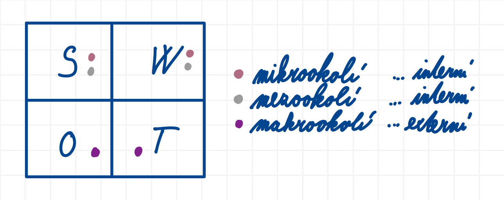

## Projektové řízení
- fáze a klíčové aspekty projektového řízení, klíčové aspekty vývoje projektu v oblasti IT, integrovaný systém řízení
- techniky projektového řízení, projektový trojúhelník, PDCA, SMART, SWOT analýza, finanční plánování
- projektový manager, projektový tým, komunikace a pravidla pro projektový tým, RACI odpovědnosti
- management změn projektu

### Užitečné odkazy
- <https://www.theengineeringmanager.com/growth/rockstars-and-superstars/>

### Projekt
- dočasná činnost s definovaným cílem, rozpočtem, časem a zdroji

### Projektové řízení
- proces plánování, organizování, řízení a kontroly projektu s cílem dosáhnout stanovených cílů
- cílem projektového řízení je dodat požadovaný výsledek:
    - v požadované kvalitě
    - v daném čase
    - v rámci rozpočtu

### Fáze projektového řízení
1. Zahájení projektu
2. Plánování projektu
3. Realizace projektu
4. Monitorování a kontrola projektu
5. Ukončení projektu

### Klíčové aspekty projektového řízení
1. Rozsah projektu (Project Scope)
2. Časové řízení (Time Management / Schedule Management)
3. Náklady a rozpočet (Cost Management / Budget Management)
4. Kvalita (Quality Management)
5. Řízení rizik (Risk Management)
6. Řízení lidských zdrojů (Human Resource Management)
7. Komunikace (Communication Management)
8. Řízení změn (Change Management)
9. Stakeholdeři projektu (Stakeholder Management)

### Klíčové aspekty vývoje projektu v oblasti IT
1. Řízení požadavků (Requirements Engineering)
2. Návrh softwarové architektury (Software Architecture Design)
3. Volba technologického stacku (Technology Stack Selection)
4. Vývoj softwaru (Software Development)
5. Zajištění kvality a testování softwaru (Software Quality Assurance and Testing)
6. Správa verzí a konfigurace (Version Control and Configuration Management)
7. Bezpečnost aplikace (Application Security)
8. Nasazení a distribuce aplikace (Deployment and Release Management)
9. Údržba a evoluce systému (Software Maintenance and Evolution)
10. Integrace systémů (System Integration)
11. Dokumentace systému (System Documentation)
12. Agilní vývoj a iterativní řízení (Agile Development and Iterative Management)
13. Řízení technického dluhu (Technical Debt Management)
14. Škálovatelnost a výkon systému (Scalability and Performance Engineering)
15. Uživatelská zkušenost a použitelnost (User Experience and Usability)

### Integrovaný systém řízení
- systém propojující více oblastí řízení organizace do jednotného a koordinovaného celku
- cílem je sjednocení procesů, odpovědností, dokumentace a kontrolních mechanismů

### SMART cíle
- S ... Specific (specifické)
- M ... Measurable (měřitelné)
- A ... Achievable (dosažitelné)
- R ... Relevant (relevantní)
- T ... Time-based (časově ohraničené)

#### Příklad
*„Do pátku dokončit implementaci přihlašování uživatelů.“*

Tento cíl je **S**pecific, protože je jasně určeno, co má být dokončeno (*implementace přihlašování uživatelů*).

Tento cíl je **M**easurable, protože v pátek půjde jednoznačně určit, zda je úkol hotový nebo ne.

Zda-li je cíl **A**chievable závisí na kontextu projektu, dostupném čase, zkušenostech týmu a dostupných zdrojích. Např. pokud je pátek odpoledne, tým má spoustu jiné práce a ještě ani nezačal na implementaci přihlašování pracovat, pak cíl pravděpodobně není realistický. Stejný cíl však může být dosažitelný, pokud je většina funkcionality již připravena a zbývá pouze dokončení a otestování.

Tento cíl může být **R**elevant, protože přihlašování bývá důležitou součástí softwaru.

Tento cíl je **T**ime-bound, protože cíl obsahuje konkrétní termín (*do pátku*).

### RACI matice
- nástroj pro rozdělení odpovědností v projektu nebo procesu
- slouží k jasnému určení:
    - kdo vykonává práci,
    - kdo rozhoduje,
    - kdo poskytuje konzultace,
    - kdo má být informován
- cílem je:
    - odstranit nejasnosti v odpovědnostech
    - zlepšit komunikaci
    - zamezit duplicitám nebo opomenutím
- jednotlivé role:
    - R — Responsible
        - osoba přímo vykonávající danou činnost
        - za úkol může být odpovědných více lidí
    - A — Accountable
        - osoba nesoucí konečnou odpovědnost za výsledek
        - schvaluje výstup
        - pro jednu činnost by měl být pouze jeden Accountable
    - C — Consulted
        - osoby poskytující konzultace, odborné znalosti nebo zpětnou vazbu
        - komunikace probíhá obousměrně
    - I — Informed
        - osoby, které musí být informovány o průběhu nebo výsledku
        - komunikace probíhá jednostranně
- příklad:
    - implementace přihlašování uživatelů
        - developer → Responsible
        - projektový manažer → Accountable
        - bezpečnostní specialista → Consulted
        - zákazník → Informed

### Typologie týmových rolí
1. Topologie dle manažera Michaela Loppa (kniha Managing Humans)
    - superstars
        - vysoce ambiciózní a výrazní členové týmu
        - usilují o rychlý růst, odpovědnost a viditelný dopad
        - často přinášejí změny, nové nápady a vysoké tempo práce
        - mohou být motorem inovací, ale někdy i zdrojem nestability týmu
    - rockstars
        - stabilní, konzistentní a dlouhodobě spolehliví členové týmu
        - preferují odbornou práci a stabilitu před rychlým kariérním růstem
        - udržují kontinuitu, předávají zkušenosti a stabilizují tým
        - představují důležitý pilíř efektivního fungování projektu

2. Balbinova typologie (Meredith Belbin)
    - role orientované na:
        - myšlení
        - lidi
        - akci

### SWOT analýza
- S — Strengths (silné stránky)
- W — Weaknesses (slabé stránky)
- O — Opportunities (příležitosti)
- T — Threats (hrozby)

#### STEP analýza
#### Porterův model pěti sil

### Strategie řízení změn
- anglicky Change management
- souvisí se SWOT analýzou rizik

### Ukázková úloha
Vaším úkolem je provést analýzu a popsat potenciální postup řízení projektu, který se zabývá
vývojem a nasazením nového webového obchodu (e-shopu), který má nahradit prodej v kamenných
prodejnách.

Úkoly:
1. Cíl projektu zní: “Z důvodu nízkých prodejů žvýkaček s vtipným tetováním pro programátory
v kamenných obchodech a vysokých provozních nákladech chceme přejít na internetové
řešení prodeje formou e-shopu do jednoho roku. Na implementaci máme 5 milionů Kč.”.
Rozdělte dlouhodobý cíl na dílčí úkoly, které popište pomocí metodiky SMART.
2. Zhodnoťte pomocí SWOT analýzy silné stránky a slabé stránky předloženého projektu.
Zvažte faktory z externího okolí (např. sociologické, technologické, ekonomické, politické) a
faktory z interního okolí (např. tržní síla dodavatelů, tržní síla odběratelů, stávající
konkurence, nově vznikající konkurence, možnost substituce našich produktů).
3. Navrhněte složení projektového týmu a rozdělte odpovědnosti imaginárním členům pomocí
RACI techniky. Využijte role, jako jsou např. projektový manažer, programátoři, architekt,
UI a UX návrhář, QA odborník aj.
4. Zhodnoťte rizika projektu a navrhněte strategii, jak k nim budete přistupovat (přijetí,
přenesení, vyhýbání se, snížení)

Rozšiřující požadavky
1. Proveďte finanční rozvahu projektu a naplánujte harmonogram realizace projektu.
2. Navrhněte mechanismy, kterými uděláte projekt více agilní. Inspirovat se můžete
z metodiky Prince2 agile, SCRUM, Kanban aj.
3. Navrhněte šablony pro projektové artefakty, inspirovat se můžete artefakty z projektových
metodik Prince2, PMP a jiných, které znáte. Artefakty vytvořte v tabulkovém kalkulátoru.
4. Navrhněte pomocí technik managementu změn, jak zajistit hladký přechod na elektronický
systém z pohledu interních procesů podniku. Můžete navrhnout specifické komunikační
strategie, školení pro zaměstnance, sběr zpětné vazby a jiné užitečné nástroje pro hladký
přechod.

Požadavky na odevzdání
- Textový dokument nebo prezentační snímky ve formátu PDF s rozepsáním jednotlivých klíčových
partií projektu.

Seznam dostupných materiálů a technologií
- Počítač s operačním systémem Windows a nainstalovaným kancelářským softwarem MS
Word, MS Powerpoint, MS Excel a jejich Libre varianty

## Mé řešení ukázkové úlohy

