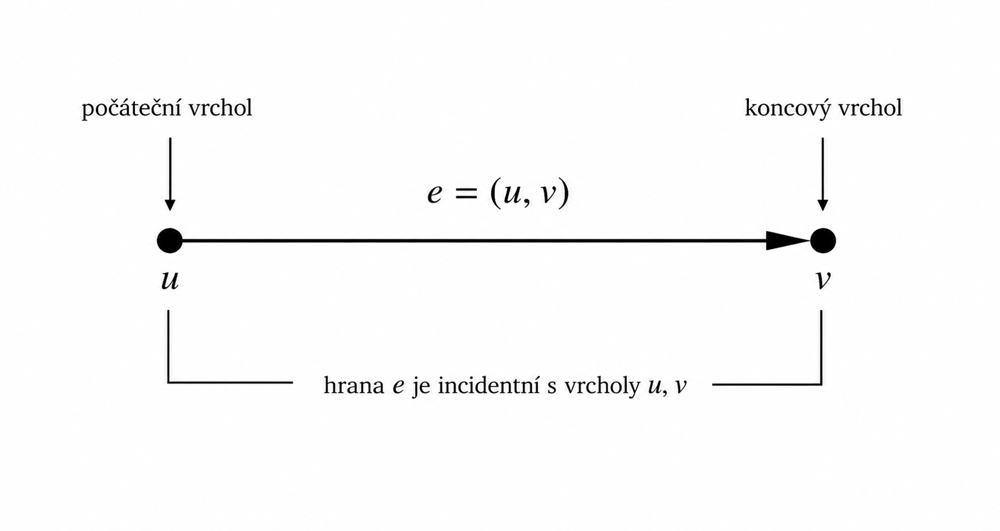
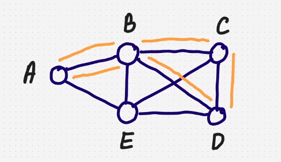
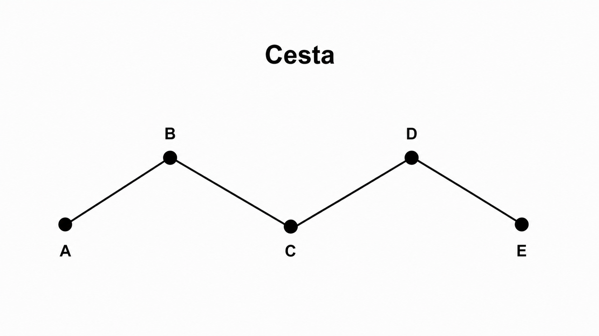
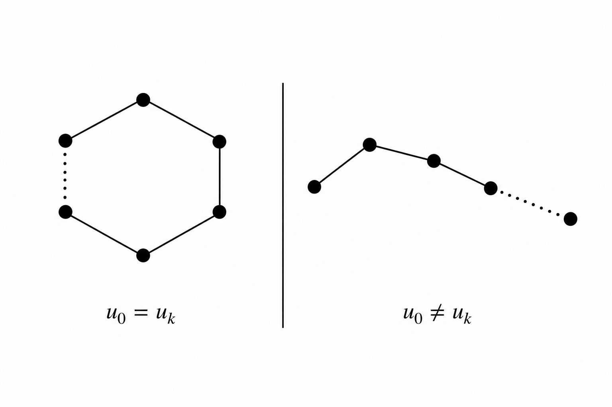

## 12

Grafy (definice orientovaného a neorientovaného grafu, jejich vlastnosti a reprezentace, význačné typy grafů), stromy (vymezení a základní charakteristiky, binární stromy a jejich reprezentace), eulerovské a hamiltonovské grafy (eulerovský tah, hamiltonovská kružnice a cesta), prohledávání do hloubky a do šířky

### Užitečné odkazy
- <https://szz.ondrejsvorc.cz/1%20-%20SZZTP%20-%20Teoretick%C3%A9%20z%C3%A1klady%20informatiky/12/>
- <https://cw.fel.cvut.cz/b212/_media/courses/b0b01lgr/lectures/grafy-orientovane.pdf>
- <https://www.youtube.com/watch?v=t5XZ1gc70dw> (Walks, Trails and Paths)

### Graf
- matematická struktura tvořená vrcholy a hranami, která slouží k modelování vztahů mezi vrcholy pomocí hran

Graf je definován jako uspořádaná dvojice:
$$G = (V, E)$$

kde:
- V (vertices) = množina vrcholů ($V \neq \emptyset$)
- E (edges) = množina hran, které určují vztahy mezi vrcholy ($E \subseteq V \times V$)

### Typy grafů
- orientovaný
- neorientovaný
- konečný
- nekonečný
- úplný
- neúplný
- cyklický
- acyklický
- bipartitní
- souvislý

### Vrchol
- prvek grafu reprezentující objekt, mezi nímž a ostatními vrcholy mohou existovat vztahy vyjádřené hranami
- prvek množiny $V$

### Hrana
- prvek grafu reprezentující vztah mezi dvěma vrcholy
- prvek množiny $E$

Pokud $e = (u, v)$ je hrana, říkáme, že $u$ je počáteční vrchol, $v$ je koncový vrchol hrany $e$ a že hrana $e$ je incidentní s vrcholy $u$, $v$.

Slovo incidentní znamená, že hrana je připojená k vrcholu.

### Sled
- posloupnost vrcholů
- může projít vrcholem vícekrát
- může projít hranou vícekrát
- délka sledu = počet hran

Sled délky $k$ z vrcholu $u$ do vrcholu $v$:

$$p = (u_0, u_1, \ldots, u_k), \quad \text{kde } u = u_0,\ v = u_k$$

kde
- u = začátek
- v = konec

### Tah
- sled, ve kterém se neopakují hrany
- nelze použít stejnou hranu dvakrát
- stejný vrchol může být dosažen vícekrát různými hranami

### Cesta
- sled, ve kterém se neopakují vrcholy
- nelze navštívit stejný vrchol dvakrát
- každá hrana se tím pádem použije nejvýše jednou

Graf na obrázku:
$$
V = \{A, B, C, D, E\}
$$

$$
E = \{(A,B), (B,C), (C,D), (D,E)\}
$$

### Vlastnost zavřený a otevřený
- uzavřený = začátek a konec jsou stejné vrcholy
- otevřený = začátek a konec jsou různé vrcholy  

Formálně:
$$u_0 = u_k \quad \text{(uzavřený)}$$
$$u_0 \neq u_k \quad \text{(otevřený)}$$

Platí obecně pro:
- sled
- tah
- cestu

### Cyklus
- uzavřená cesta

### Neorientovaný graf
- graf, ve kterém hrany nemají směr

#### Vlastnosti neorientovaného grafu
- každá hrana je neuspořádaná dvojice vrcholů
- hrany $(u, v)$ $\neq$ $(v, u)$
- hrana $\{u, v\}$ znamená spojení mezi vrcholy $u$ a $v$ bez určení směru

### Orientovaný graf
- graf, ve kterém mají hrany určený směr

#### Vlastnosti orientovaného grafu
- každá hrana je uspořádaná dvojice vrcholů
- hrany $(u, v)$ $=$ $(v, u)$
- hrana $(u, v)$ znamená orientované spojení z vrcholu $u$ do vrcholu $v$

### Reprezentace grafů
- seznamy sousedů
- matice sousednosti
- matice incidence

### Význačné typy grafů
- úplný
- souvislý
- cyklický
- acyklický
- bipartitní

#### Úplný graf
#### Souvislý graf
#### Cyklický graf
#### Acyklický graf
#### Bipartitní graf

### Strom
- souvislý acyklický graf

#### Binární strom

#### Reprezentace binárních stromů

### Eulerovský graf

#### Eulerovský tah

### Hamiltonovský graf

#### Hamiltonovská kružnice

#### Hamiltonovská cesta

### Prohledávání grafu

#### Prohledávání do hloubky

#### Prohledávání do šířky