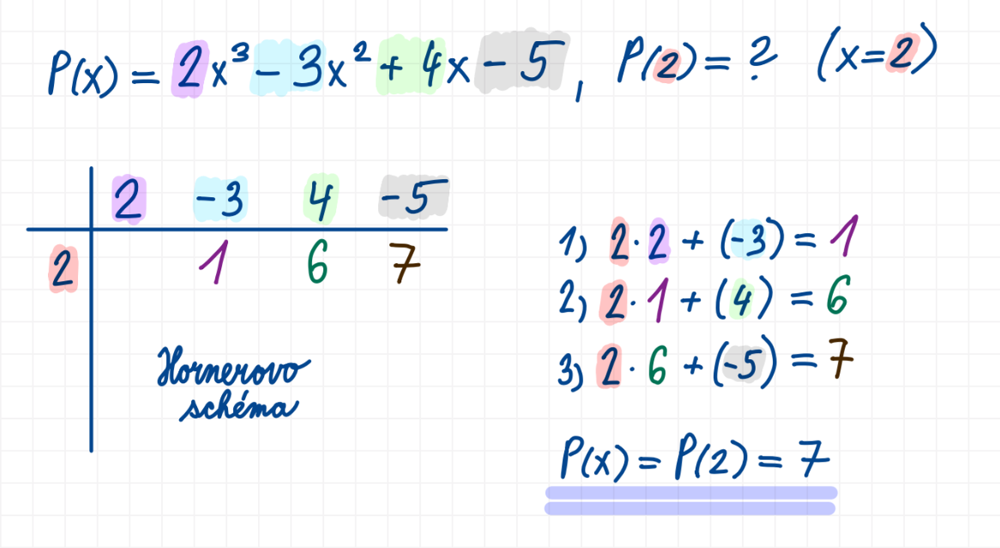

## 4

Reálná funkce jedné reálné proměnné (definice, definiční obor a obor hodnot, graf funkce, limita a spojitost funkce), polynomy (definice, vlastnosti, Hornerovo schéma), numerické řešení nelineárních rovnic (metoda půlení intervalu, Newtonova metoda)

### Užitečné odkazy
- <https://szz.ondrejsvorc.cz/1%20-%20SZZTP%20-%20Teoretick%C3%A9%20z%C3%A1klady%20informatiky/4/>

### Funkce
- zobrazení mezi dvěma množinami

$$f : A \to B$$

Každému prvku z množiny $A$ přiřazuje právě jeden prvek z množiny $B$.

$$
A,B \subseteq U
$$

$A$ i $B$ jsou podmnožiny univerza $U$. V kontextu funkce můžeme tvrdit, že:
- $A$ = definiční obor
- $B$ = obor hodnot

Univerzum je množina všech prvků uvažovaných v daném kontextu. V kontextu funkce mohou být z univerza vybírány prvky tvořící:
- definiční obor
- obor hodnot
- kartézský součin
- ...

Předpis funkce pak popisuje závislost mezi prvky definičního oboru a odpovídajícími prvky oboru hodnot. Jinými slovy určuje, jakým způsobem se z hodnoty vstupu vypočítá odpovídající hodnota výstupu.

### Reálná funkce
- funkce, jejíž definiční obor i obor hodnot jsou tvořeny reálnými čísly

$$
f : A \to B
$$

$$
A,B \subseteq \mathbb{R}
$$

$$
f : \mathbb{R} \to \mathbb{R}
$$

Každému reálnému číslu z definičního oboru přiřazuje právě jedno reálné číslo z oboru hodnot.

### Reálná funkce jedné proměnné
- reálná funkce, jejíž vstup je tvořen právě jednou proměnnou

$$
x \in \mathbb{R}
$$

$$
f(x) \in \mathbb{R}
$$

### Definiční obor
- množina všech hodnot vstupní proměnné, pro které je funkce definována a dokáže přiřadit odpovídající hodnotu z oboru hodnot
- intuitivně představuje všechny hodnoty na ose $x$, pro které má funkce smysl a lze vypočítat její hodnotu

Značí se:
$$
D(f)
$$

Pro každou hodnotu:
$$
x \in D(f)
$$

musí být možné určit odpovídající funkční hodnotu:
$$
f(x)
$$

#### Příklad
$$
f(x)=\frac{1}{x}
$$

$$
D(f)=\mathbb{R}\setminus\{0\}
$$

protože pro danou hodnotu:

$$
x=0
$$

nelze určit funkční hodnotu.

### Obor hodnot
- množina všech hodnot, kterých může funkce nabývat
- intuitivně představuje všechny hodnoty na ose $y$, které může funkce vytvořit

Značí se:
$$
H(f)
$$

Každá funkční hodnota:

$$
f(x)
$$

patří do oboru hodnot.

#### Příklad
$$
f(x)=x^2
$$
$$
H(f)=[0,\infty)
$$

protože druhá mocnina reálného čísla nikdy není záporná.

### Graf funkce
- množina všech bodů, které reprezentují funkční hodnoty dané funkce v konkrétní soustavě souřadnic (např. kartézské)

Každý bod grafu odpovídá dvojici:
$$
[x,f(x)]
$$

Graf funkce tvoří všechny body:
$$
\{[x,f(x)] \mid x \in D(f)\}
$$

### Příklad
$$
f(x)=x^2
$$
Grafem této funkce je parabola otevřená směrem nahoru.

### Limita
- číslo, ke kterému se funkce v nějakém bodě blíží
- popisuje chování funkce v okolí daného bodu, nikoliv nutně přímo v tomto bodě

$$
\lim_{x \to a} f(x)=L
$$

To znamená, že pokud se:
$$
x \to a
$$

pak se odpovídající funkční hodnoty:
$$
f(x) \to L
$$

přičemž „$\to$“ v tomto kontextu čteme jako „se blíží k“.

### Limita zleva

$$
\lim_{x \to a^-} f(x)
$$

- hodnota, ke které se funkce blíží při přibližování k bodu $a$ zleva

### Limita zprava

$$
\lim_{x \to a^+} f(x)
$$

- hodnota, ke které se funkce blíží při přibližování k bodu $a$ zprava

### Existence limity
- limita existuje právě tehdy, když existuje limita zleva i limita zprava a vychází stejně

$$
\lim_{x \to a^-} f(x)=\lim_{x \to a^+} f(x)=L
\Rightarrow
\lim_{x \to a} f(x)=L
$$

Například funkce:

$$
f(x)=\frac{1}{x}
$$

nemá v bodě $x=0$ limitu, protože:

$$
\lim_{x \to 0^-} \frac{1}{x}=-\infty
$$

$$
\lim_{x \to 0^+} \frac{1}{x}=+\infty
$$

limita zleva a limita zprava nejsou stejné.

### Spojitost funkce
- funkce je spojitá v bodě $a \in D(f)$, pokud limita funkce v bodě $a$ existuje a je rovna funkční hodnotě v tomto bodě

$$
\lim_{x \to a} f(x)=f(a)
$$

### Polynom
- synonymum: mnohočlen
- funkce tvořená součtem členů ve tvaru konstanty násobené nezápornou celočíselnou mocninou proměnné

Polynom je výraz ve tvaru:

$$
p(x)=\sum_{i=0}^{n} a_i x^i = a_0 + a_1x + a_2x^2 + \dots + a_nx^n
$$

kde:

- $a_0, a_1, \dots, a_n$ jsou reálná čísla (tzv. koeficienty)
- $n$ je nezáporné celé číslo
- proměnná $x$ vystupuje pouze v celočíselných nezáporných mocninách

### Stupeň polynomu
- nejvyšší exponent proměnné $x$ s nenulovým koeficientem

$$
\deg(p)
$$

#### Příklad

$$
p(x)=x^2-4
$$

$$
\deg(p)=2
$$

Polynom $p(x)$ je polynom druhého stupně.

#### Terminologie
- polynom 1. stupně = lineární polynom
- polynom 2. stupně = kvadratický polynom
- polynom 3. stupně = kubický polynom
- polynom 4. stupně = kvartický polynom
- ...

### Vlastnosti polynomu
- polynom stupně $n$ může mít maximálně $n$ kořenů
- polynom lze sčítat, odčítat, násobit i derivovat a výsledkem je opět polynom
- člen s nejvyšší mocninou nejvíce ovlivňuje chování grafu

### Rovnost polynomů
Polynomy $p(x)$ a $q(x)$ jsou si rovny právě tehdy, když mají stejné koeficienty u členů se stejnými exponenty proměnné $x$.

### Operace s polynomy
- polynomy můžeme sčítat, odčítat a násobit
- při sčítání a odčítání se sčítají koeficienty členů se stejnými exponenty
- při násobení se exponenty sčítají
- derivací polynomu vznikne opět polynom
- součinem dvou polynomů vznikne opět polynom
- součet dvou polynomů je opět polynom

### Hornerovo schéma
- efektivní způsob výpočtu hodnoty polynomu bez opakovaného počítání mocnin
- používá pouze násobení a sčítání
- vhodné pro numerické výpočty i implementaci v programu

Bez Hornerova schématu bychom hodnotu polynomu počítali přímým dosazením:

$$
P(x)=2x^3-3x^2+4x-5
$$

pro $x=2$:

$$
P(2)=2 \cdot 2^3 - 3 \cdot 2^2 + 4 \cdot 2 - 5
$$

$$
=2 \cdot 8 - 3 \cdot 4 + 8 - 5
$$

$$
=16 -12 +8 -5
$$

$$
=7
$$

Musíme zde opakovaně počítat mocniny:
- $2^2$
- $2^3$

U polynomů vysokého stupně by byl tento výpočet pomalý.

### Numerické řešení nelineárních rovnic

### Metoda půlení intervalu

### Newtonova metoda